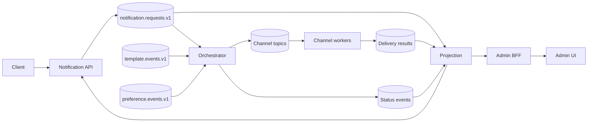

# Notification Platform

A learning-focused, Kafka-based notification platform implemented as Spring Boot microservices with a React admin UI.

## Architecture at a glance



The API returns `202 Accepted` only after Kafka acknowledges the request. `ACCEPTED` means the command is durable in Kafka; it does not mean provider delivery has completed.

## Components

| Component | Port | Responsibility |
| --- | ---: | --- |
| `notification-api-service` | 8081 | Validation, admission control, Kafka intake, acceptance cache, projection reads |
| `notification-orchestrator-service` | 8091 | Idempotent orchestration, template/preference projections, durable delivery/status outbox |
| `notification-projection-service` | 8092 | Rebuildable notification and delivery query model |
| `template-service` | 8082 | Products, templates, rendering, template change events |
| `preference-service` | 8083 | User/channel preferences and preference change events |
| `email-worker-service` | 8085 | Email delivery through SMTP or the test provider |
| `sms-worker-service` | 8086 | SMS delivery and local test inbox |
| `push-worker-service` | 8087 | Push delivery and local test inbox |
| `in-app-worker-service` | 8089 | Durable in-app inbox |
| `webhook-worker-service` | 8090 | Webhook delivery and local receiver |
| `admin-bff-service` | 8088 | Admin-facing API composition |
| `admin-frontend` | 5173 | React admin UI |

Shared modules:

- `shared-event-contracts`: versioned Kafka DTOs.
- `worker-kafka-support`: retry, DLQ, rate limiting, deduplication, and result publishing.
- `platform-common`: shared platform configuration.

Local infrastructure includes PostgreSQL (`5432`), Redis (`6379`), Kafka (`9092`), Kafka UI (`8080`), MailHog (`8025`), Prometheus (`9090`), Grafana (`3000`), Loki, Jaeger (`16686`), and the OpenTelemetry Collector.

## Run locally

Requirements: Java 21, Maven, Node.js 20 or newer with npm, Docker, and Docker Compose.

```bash
mvn -f services/pom.xml test
npm --prefix frontend ci
npm --prefix frontend run build
docker compose up -d --build
```

The root `docker-compose.yml` includes `docker-compose.microservices.yml`.

Example request:

```bash
curl -i http://localhost:8081/notifications \
  -H 'Content-Type: application/json' \
  -d '{
    "userId": "user-1",
    "productId": "demo-product",
    "channel": "EMAIL",
    "templateKey": "welcome",
    "variables": {"name": "Ada"},
    "idempotencyKey": "welcome-user-1",
    "destination": "ada@example.com"
  }'
```

## Useful endpoints

- Notification intake: `POST http://localhost:8081/notifications`
- Notification query: `GET http://localhost:8081/notifications/{id}`
- Projection query: `GET http://localhost:8092/projections/notifications`
- Templates: `GET http://localhost:8082/templates`
- Preferences: `GET http://localhost:8083/preferences`
- Admin API: `GET http://localhost:8088/admin/dashboard`
- MailHog: `http://localhost:8025`
- Kafka UI: `http://localhost:8080`
- Grafana: `http://localhost:3000`

## Documentation

- [Architecture](docs/architecture.md)
- [Comprehensive codebase guide](docs/codebase-understanding-guide.md)
- [Event contracts](docs/event-contracts.md)
- [Delivery semantics](docs/delivery-semantics.md)
- [Storage strategy](docs/storage-strategy.md)
- [Backpressure and admission control](docs/backpressure-and-admission-control.md)
- [Retry and DLQ behavior](docs/retry-and-dlq.md)
- [Local runbook](docs/local-run-kafka.md)
- [Load testing](docs/load-testing.md)
- [Failure scenarios](docs/failure-scenarios.md)
- [Observability](docs/observability.md)
- [Kubernetes configuration](docs/kubernetes-configuration.md)
