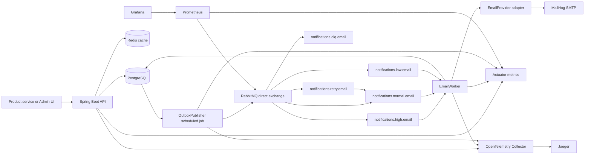
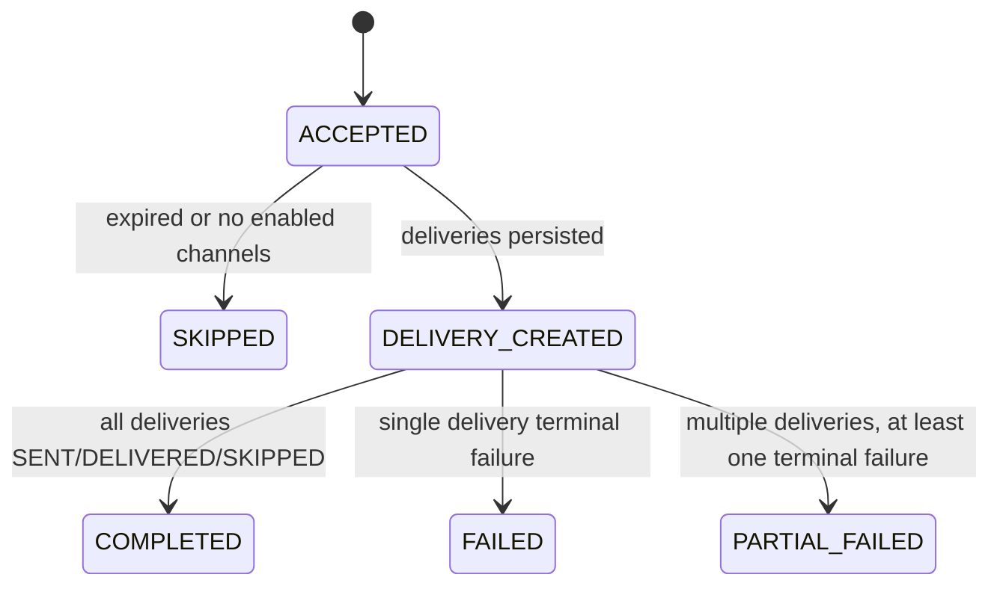
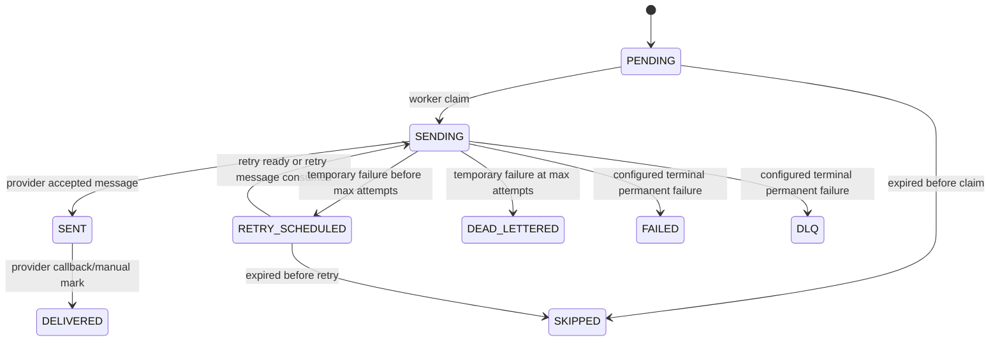
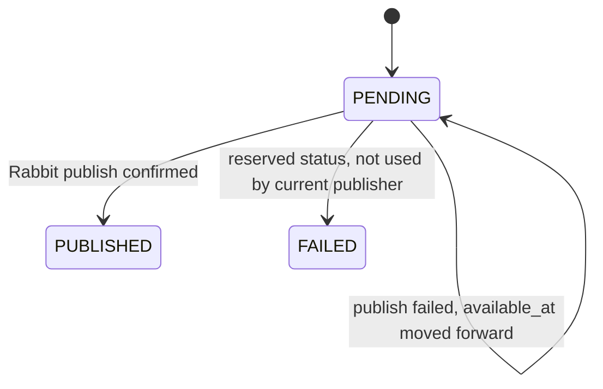

# Notification Platform Technical Deep Dive

This document explains the current Notification Platform implementation as it exists in this repository. It is written for developers who need to understand the system end to end: domain model, APIs, async processing, reliability mechanisms, observability, local runtime, and operational debugging.

The platform is intentionally a modular monolith today. PostgreSQL is the source of truth. Redis is used only as an optimization. RabbitMQ is used for async delivery work. Provider-specific sending is hidden behind adapters.

## 1. System Overview

The Notification Platform accepts product-scoped notification requests, persists durable request and delivery state, and asynchronously sends delivery work through provider adapters. The current implemented delivery channel is `EMAIL`; the domain model already has `SMS`, `PUSH`, and `IN_APP`, but those channels are rejected at submission time until channel workers and publishers exist.

Main use cases:

- Create products that represent applications or product teams.
- Create product-scoped, channel-specific notification templates.
- Store user notification preferences by `product_id`, `external_user_id`, category, and channel.
- Submit single notifications and batches with idempotency keys.
- Persist notification request and delivery history.
- Publish delivery work through an outbox into RabbitMQ.
- Process email deliveries through a worker and provider adapter.
- Retry temporary provider failures and dead-letter exhausted deliveries.
- Observe throughput, latency, failures, queue depth, outbox lag, and traces locally.

The system uses async processing because the API should not wait for SMTP/provider latency. The API persists the intent to notify and returns quickly. Delivery work happens later from RabbitMQ, allowing provider failure, retry, and worker restarts without losing the original request.

Main components:

- Notification API: `NotificationController` accepts notification and batch requests.
- Management API: product, template, preference, delivery, and dashboard controllers.
- PostgreSQL: source of truth for products, templates, preferences, requests, deliveries, attempts, batches, and outbox events.
- Outbox Publisher: `OutboxPublisher` polls pending outbox events and publishes delivery messages.
- RabbitMQ: direct exchange and durable queues for priority email work, retry, and DLQ.
- Workers: `EmailWorker` consumes email delivery messages and calls an `EmailProvider`.
- Providers: `MockEmailProvider` and `MailHogEmailProvider` implement `EmailProvider`.
- Redis: cache for active template IDs, preference booleans, and idempotent notification IDs; also has an unused reusable rate limiter.
- Prometheus: scrapes backend actuator metrics and RabbitMQ metrics.
- Grafana: provisioned dashboards for day-to-day and stress-test visibility.
- Jaeger/OpenTelemetry: traces selected application spans through OTLP collector.
- MailHog: local SMTP sink and UI for inspecting emails.



## 2. Repository Structure

Top-level structure:

```text
src/main/java/com/notificationplatform
├── NotificationPlatformApplication.java
├── application
│   ├── cache
│   ├── common
│   ├── delivery
│   ├── management
│   ├── notification
│   ├── observability
│   ├── outbox
│   ├── preferences
│   ├── provider
│   ├── queue
│   └── worker
├── domain
│   ├── common
│   ├── entity
│   ├── model
│   └── repository
└── web
    ├── controller
    ├── dto
    └── error
```

Important folders:

- `src/main/java/com/notificationplatform/domain/entity`: JPA entities such as `NotificationRequest`, `NotificationDelivery`, and `OutboxEvent`.
- `src/main/java/com/notificationplatform/domain/model`: enums stored as strings, for example `DeliveryStatus` and `NotificationPriority`.
- `src/main/java/com/notificationplatform/domain/repository`: Spring Data repositories and custom polling queries.
- `src/main/java/com/notificationplatform/application/notification`: notification submission use cases and command records.
- `src/main/java/com/notificationplatform/application/delivery`: delivery state transitions and attempt persistence.
- `src/main/java/com/notificationplatform/application/outbox`: outbox service and scheduled publisher.
- `src/main/java/com/notificationplatform/application/queue`: RabbitMQ topology, message DTO, and publisher.
- `src/main/java/com/notificationplatform/application/worker`: scheduled retry enqueueing and email consumer.
- `src/main/java/com/notificationplatform/application/provider`: provider adapter interfaces and mock/MailHog implementations.
- `src/main/java/com/notificationplatform/application/cache`: Redis cache wrappers and rate limiter foundation.
- `src/main/java/com/notificationplatform/application/observability`: Micrometer metrics, custom observations, and MDC helper.
- `src/main/java/com/notificationplatform/web/controller`: REST controllers.
- `src/main/java/com/notificationplatform/web/dto`: API request/response records.
- `src/main/resources/db/migration`: Flyway migrations. Hibernate uses `ddl-auto: validate`; Flyway owns schema.
- `frontend`: React/Vite admin UI.
- `observability`: Prometheus, Grafana, and OpenTelemetry Collector config.
- `tests/load`: k6 load and stress tests.

Application package responsibilities:

- `NotificationSubmissionService`: validates notification commands, enforces product/channel rules, checks idempotency, resolves templates/preferences, creates request/delivery rows, and creates outbox events.
- `NotificationDeliveryService`: claims deliveries, creates `DeliveryAttempt` rows, records success/failure, refreshes request-level status, and exposes delivery queries.
- `OutboxPublisher`: scheduled batch publisher using `FOR UPDATE SKIP LOCKED` and bulk status updates.
- `RabbitMqTopology`: exchange, queues, bindings, JSON converter, manual ack listener container, and `RabbitTemplate`.
- `EmailWorker`: manual-ack Rabbit listener, provider call, retry/DLQ decision.
- `TemplateManagementService`, `ProductManagementService`, `UserPreferenceService`: management operations.
- `NotificationCacheService`: Redis cache for active templates, preferences, and idempotency lookup acceleration.

## 3. Domain Model and Entities

All main entities use UUID primary keys. Most entities extend `BaseEntity`, which provides `id`, `created_at`, and `updated_at` through Hibernate timestamps.

### Product

Class: `src/main/java/com/notificationplatform/domain/entity/Product.java`

Purpose: product teams or applications that send notifications.

Important fields:

- `id`: UUID primary key.
- `name`: unique product name.
- `status`: `ACTIVE` or `DISABLED`.
- `created_at`, `updated_at`: audit timestamps.

Lifecycle:

1. Created by `ProductManagementService.createProduct`.
2. Defaults to `ACTIVE`.
3. `NotificationSubmissionService` rejects sends for disabled products.

Constraints and indexes:

- `uk_products_name` unique on `name`.
- `chk_products_status` restricts status values.

Example row:

```text
id: 7b70fbf7-7bd4-40c5-9264-59f641be90fb
name: Billing
status: ACTIVE
```

### NotificationTemplate

Class: `src/main/java/com/notificationplatform/domain/entity/NotificationTemplate.java`

Purpose: product-scoped template content for a channel and version.

Important fields:

- `product`: owning product.
- `templateKey`: logical template name, for example `invoice.created`.
- `channel`: `EMAIL`, `SMS`, `PUSH`, `IN_APP`.
- `version`: positive integer.
- `subject`: optional subject, used by email.
- `content`: required body content.
- `status`: `DRAFT`, `ACTIVE`, or `ARCHIVED`.

Lifecycle:

1. Created by `TemplateManagementService.createTemplate`.
2. Can be `DRAFT` or `ACTIVE` at creation.
3. Only one active template is allowed per product, template key, and channel.
4. Send flow resolves the active template by `(productId, templateKey, channel)`.

Constraints and indexes:

- Unique `(product_id, template_key, channel, version)`.
- Partial unique index `(product_id, template_key, channel) WHERE status = 'ACTIVE'`.
- Index `(product_id, status)`.

Example row:

```text
product_id: 7b70fbf7-7bd4-40c5-9264-59f641be90fb
template_key: invoice.created
channel: EMAIL
version: 1
subject: Invoice ready
content: Hello {{name}}, your invoice is ready.
status: ACTIVE
```

### UserNotificationPreference

Class: `src/main/java/com/notificationplatform/domain/entity/UserNotificationPreference.java`

Purpose: product-scoped opt-in/opt-out state for a user, category, and channel. The platform does not own full user profiles; callers provide `external_user_id` and recipient details.

Important fields:

- `product`: owning product.
- `externalUserId`: caller-owned user identifier.
- `category`: notification category such as `invoice` or `marketing`.
- `channel`: delivery channel.
- `enabled`: boolean preference value.

Lifecycle:

1. Created or updated by `UserPreferenceService.setPreference`.
2. Read during notification submission by `isChannelEnabled`.
3. Missing preference defaults to enabled.

Constraints and indexes:

- Unique `(product_id, external_user_id, category, channel)`.
- Index `(product_id, external_user_id)`.

Example row:

```text
external_user_id: user-123
category: invoice
channel: EMAIL
enabled: true
```

### NotificationBatch

Class: `src/main/java/com/notificationplatform/domain/entity/NotificationBatch.java`

Purpose: tracks a batch submission and counters for accepted/failed items.

Important fields:

- `product`: owning product.
- `idempotencyKey`: product-scoped batch idempotency key.
- `status`: `ACCEPTED`, `PROCESSING`, `COMPLETED`, `PARTIAL_FAILED`, or `FAILED`.
- `totalCount`, `acceptedCount`, `failedCount`.

Lifecycle:

1. Created by `NotificationSubmissionService.createNotificationBatch`.
2. Set to `PROCESSING` while iterating items.
3. Ends as `COMPLETED`, `PARTIAL_FAILED`, or `FAILED`.

Constraints and indexes:

- Unique `(product_id, idempotency_key)`.
- Check that counters are non-negative and accepted + failed <= total.
- Index `(product_id, created_at DESC)`.

Example row:

```text
idempotency_key: batch-2026-06-10-001
status: COMPLETED
total_count: 1000
accepted_count: 1000
failed_count: 0
```

### NotificationRequest

Class: `src/main/java/com/notificationplatform/domain/entity/NotificationRequest.java`

Purpose: original API request and orchestration-level status. It is separate from provider delivery state.

Important fields:

- `product`: owning product.
- `batch`: optional batch.
- `templateKey`: requested logical template.
- `requestedChannels`: JSON array of channels.
- `externalUserId`: product-owned user id.
- `idempotencyKey`: product-scoped idempotency key.
- `category`: preference category.
- `priority`: `HIGH`, `NORMAL`, `LOW`.
- `payload`: JSON object passed with the request.
- `recipient`: JSON object such as `{ "email": "user@example.com" }`.
- `status`: request-level enum.
- `expiresAt`: optional expiry.

Lifecycle:

1. Submission starts with `ACCEPTED`.
2. If expired or all channels disabled, status becomes `SKIPPED`.
3. If deliveries are created, status becomes `DELIVERY_CREATED`.
4. Delivery updates eventually move the request to `COMPLETED`, `FAILED`, or `PARTIAL_FAILED`.

Constraints and indexes:

- Unique `(product_id, idempotency_key)`.
- Index `(product_id, external_user_id, created_at DESC)`.
- Index `(status, created_at)`.
- Index `(batch_id)`.

Example row:

```json
{
  "template_key": "invoice.created",
  "requested_channels": ["EMAIL"],
  "external_user_id": "user-123",
  "idempotency_key": "request-abc",
  "category": "invoice",
  "priority": "HIGH",
  "payload": { "name": "Ada" },
  "recipient": { "email": "ada@example.test" },
  "status": "DELIVERY_CREATED"
}
```

### NotificationDelivery

Class: `src/main/java/com/notificationplatform/domain/entity/NotificationDelivery.java`

Purpose: one concrete delivery for a notification request and channel.

Important fields:

- `notificationRequest`: parent request.
- `template`: resolved concrete template version.
- `channel`: delivery channel.
- `destination`: resolved destination, such as email address.
- `status`: delivery-level state.
- `attemptCount`, `maxAttempts`.
- `nextAttemptAt`: retry schedule.
- `lockedUntil`: worker lock expiry.
- `provider`, `providerMessageId`, `providerResponse`.
- `lastErrorCode`, `lastErrorMessage`.
- `sentAt`, `deliveredAt`, `failedAt`, `expiresAt`.

Lifecycle:

1. Created as `PENDING`.
2. Worker claims it as `SENDING`, increments `attemptCount`, and writes a `DeliveryAttempt`.
3. Provider success changes it to `SENT`.
4. Temporary failure changes it to `RETRY_SCHEDULED` or `DEAD_LETTERED`.
5. Permanent failure changes it to `FAILED`, `DEAD_LETTERED`, or `DLQ` based on config.
6. Expired delivery can become `SKIPPED`.

Constraints and indexes:

- Unique `(notification_request_id, channel)`.
- Check `attempt_count <= max_attempts`.
- Index `(notification_request_id)`.
- Partial index `(next_attempt_at, expires_at, created_at) WHERE status IN ('PENDING', 'RETRY_SCHEDULED')`.
- Partial index `idx_notification_deliveries_sending_lock_recovery` on `(locked_until, expires_at, created_at) WHERE status = 'SENDING'`.
- Index `(provider, provider_message_id) WHERE provider_message_id IS NOT NULL`.

Example row:

```text
channel: EMAIL
destination: ada@example.test
status: RETRY_SCHEDULED
attempt_count: 1
max_attempts: 3
next_attempt_at: 2026-06-10T09:20:00Z
last_error_code: TEMPORARY_FAILURE_503
```

### DeliveryAttempt

Class: `src/main/java/com/notificationplatform/domain/entity/DeliveryAttempt.java`

Purpose: immutable-ish history of provider attempts. The delivery row stores current state; attempt rows tell what happened per attempt.

Important fields:

- `notificationDelivery`: parent delivery.
- `attemptNumber`: 1-based attempt number.
- `status`: `STARTED`, `SUCCEEDED`, or `FAILED`.
- `provider`, `providerMessageId`.
- `errorCode`, `errorMessage`.
- `requestPayload`, `responsePayload`.
- `startedAt`, `completedAt`, `createdAt`.

Lifecycle:

1. Created by `NotificationDeliveryService.markSending`.
2. Marked `SUCCEEDED` by `recordSuccess`.
3. Marked `FAILED` by `recordFailure` or `recordTerminalFailure`.

Constraints and indexes:

- Unique `(notification_delivery_id, attempt_number)`.
- Check `attempt_number > 0`.
- Index `(notification_delivery_id, created_at)`.

Example row:

```json
{
  "attempt_number": 2,
  "status": "FAILED",
  "provider": "mailhog-smtp",
  "error_code": "SMTP_SEND_FAILED",
  "error_message": "Connection refused"
}
```

### OutboxEvent

Class: `src/main/java/com/notificationplatform/domain/entity/OutboxEvent.java`

Purpose: durable event created in the same transaction as domain changes, later published to RabbitMQ.

Important fields:

- `aggregateType`: currently `NOTIFICATION_REQUEST`.
- `aggregateId`: notification request id.
- `eventType`: `NotificationAccepted` or `NotificationSkipped`.
- `payload`: JSON with request metadata and delivery IDs.
- `status`: `PENDING`, `PUBLISHED`, or `FAILED`.
- `availableAt`: publish eligibility time.
- `publishedAt`: time marked published.
- `attemptCount`, `lastError`.

Lifecycle:

1. Created as `PENDING` inside notification submission transaction.
2. Outbox publisher locks pending rows and publishes messages.
3. On success, rows become `PUBLISHED`.
4. On publish failure, rows stay `PENDING`, `attemptCount` increments, `availableAt` is delayed.

Constraints and indexes:

- Partial index `(available_at, created_at) WHERE status = 'PENDING'`.
- Index `(aggregate_type, aggregate_id)`.

Example payload:

```json
{
  "notificationRequestId": "f3a59072-ff1a-44d8-99ad-855b1ff0ad44",
  "productId": "7b70fbf7-7bd4-40c5-9264-59f641be90fb",
  "priority": "HIGH",
  "templateKey": "invoice.created",
  "requestedChannels": ["EMAIL"],
  "status": "DELIVERY_CREATED",
  "deliveryIds": ["2be219d7-2b5b-4fa2-b40c-e8ef60e8748e"]
}
```

## 4. Status State Machines

### NotificationRequestStatus

Enum: `NotificationRequestStatus`

Values:

- `ACCEPTED`
- `DELIVERY_CREATED`
- `COMPLETED`
- `PARTIAL_FAILED`
- `FAILED`
- `SKIPPED`



Who changes it:

- `NotificationSubmissionService` sets `SKIPPED` or `DELIVERY_CREATED`.
- `NotificationDeliveryService.refreshRequestStatus` sets `COMPLETED`, `FAILED`, or `PARTIAL_FAILED`.

Failure scenarios:

- Expired requests are skipped before delivery creation.
- All channels disabled by preferences produce a skipped request.
- Terminal delivery failures can make request state failed or partially failed.

### DeliveryStatus

Enum: `DeliveryStatus`

Values:

- `PENDING`
- `PROCESSING`
- `SENDING`
- `SENT`
- `DELIVERED`
- `FAILED`
- `RETRY_SCHEDULED`
- `DLQ`
- `DEAD_LETTERED`
- `SKIPPED`

`PROCESSING` still exists in the enum and schema for compatibility, but current worker code uses `SENDING`.



Who changes it:

- `NotificationSubmissionService` creates deliveries as `PENDING`.
- `NotificationDeliveryService.markSending` claims and locks work as `SENDING`.
- `EmailWorker` drives success/failure recording.
- `NotificationDeliveryService.recordSuccess`, `recordFailure`, and `recordTerminalFailure` write terminal and retry states.
- `NotificationDeliveryService.markDelivered` can mark `DELIVERED`.

Failure scenarios:

- Temporary provider exceptions schedule retry until `attemptCount >= maxAttempts`.
- Permanent provider exceptions use `notification.delivery.permanent-failure-status`.
- Worker crash after `SENDING` is recovered by stale lock handling using `locked_until`.
- Duplicate messages are skipped if delivery is not sendable.

### OutboxEventStatus

Enum: `OutboxEventStatus`

Values:

- `PENDING`
- `PUBLISHED`
- `FAILED`



Who changes it:

- `NotificationSubmissionService` creates `PENDING` events.
- `OutboxPublisher` marks rows `PUBLISHED` after queue publish.
- `OutboxPublisher.scheduleRetry` keeps failures as `PENDING` and delays `availableAt`.

## 5. API Design

All controllers live under `src/main/java/com/notificationplatform/web/controller`. Error responses are handled by `GlobalExceptionHandler` and returned as `ApiErrorResponse`.

Common error cases:

- `400 Bad Request`: validation failure, invalid enum, unsupported channel, disabled product, missing required fields.
- `404 Not Found`: missing product, template, notification, batch, or delivery.
- `409 Conflict`: duplicate product or template conflict.
- `500 Internal Server Error`: unhandled infrastructure/runtime failure.

There is no Spring Security configuration yet. TODO: add authentication, authorization, and product/tenant scoping before production use.

### Create Notification

Controller: `NotificationController`

Method and path: `POST /api/v1/notifications`

Request DTO: `SendNotificationRequest`

Purpose: create a single notification request, eligible deliveries, and an outbox event.

Request example:

```json
{
  "productId": "7b70fbf7-7bd4-40c5-9264-59f641be90fb",
  "templateKey": "invoice.created",
  "requestedChannels": ["EMAIL"],
  "externalUserId": "user-123",
  "idempotencyKey": "invoice-123-email",
  "category": "invoice",
  "priority": "HIGH",
  "payload": { "name": "Ada", "invoiceId": "INV-123" },
  "recipient": { "email": "ada@example.test" },
  "expiresAt": "2026-06-10T12:00:00Z"
}
```

Response DTO: `NotificationResponse`

Response example:

```json
{
  "id": "f3a59072-ff1a-44d8-99ad-855b1ff0ad44",
  "productId": "7b70fbf7-7bd4-40c5-9264-59f641be90fb",
  "batchId": null,
  "templateKey": "invoice.created",
  "requestedChannels": ["EMAIL"],
  "externalUserId": "user-123",
  "idempotencyKey": "invoice-123-email",
  "category": "invoice",
  "priority": "HIGH",
  "status": "DELIVERY_CREATED"
}
```

Validation rules:

- `productId`, `templateKey`, `requestedChannels`, `externalUserId`, `idempotencyKey`, `category`, and `recipient` are required.
- `templateKey` max length 120.
- `externalUserId` and `idempotencyKey` max length 160.
- `category` max length 80.
- Current service rejects non-`EMAIL` channels.
- Recipient must include `email` for email delivery.

Idempotency:

- Unique by `(product_id, idempotency_key)`.
- Retries with the same key return the existing `NotificationRequest`.
- Redis can cache idempotent notification IDs, but PostgreSQL remains authoritative.

Entity changes:

- Inserts `notification_requests`.
- Inserts one `notification_deliveries` row per enabled supported channel.
- Inserts `outbox_events` row if request accepted/skipped.

### Create Notification Batch

Method and path: `POST /api/v1/notification-batches`

Request DTO: `SendNotificationBatchRequest`

Purpose: create a batch and process each item through the same notification creation logic.

Request example:

```json
{
  "productId": "7b70fbf7-7bd4-40c5-9264-59f641be90fb",
  "idempotencyKey": "batch-001",
  "items": [
    {
      "templateKey": "invoice.created",
      "requestedChannels": ["EMAIL"],
      "externalUserId": "user-123",
      "idempotencyKey": "batch-001-item-1",
      "category": "invoice",
      "priority": "NORMAL",
      "payload": { "name": "Ada" },
      "recipient": { "email": "ada@example.test" }
    }
  ]
}
```

Response DTO: `NotificationBatchResponse`

Response example:

```json
{
  "id": "1c6cf018-15fb-4961-98db-85af7c8e76ea",
  "productId": "7b70fbf7-7bd4-40c5-9264-59f641be90fb",
  "idempotencyKey": "batch-001",
  "status": "COMPLETED",
  "totalCount": 1,
  "acceptedCount": 1,
  "failedCount": 0
}
```

Validation and idempotency:

- `items` must be non-empty.
- Batch idempotency is unique by `(product_id, idempotency_key)`.
- Each item also has its own notification idempotency key.
- Current code prevalidates supported channels before creating the batch row.

TODO:

- Batch processing currently catches `RuntimeException` per item inside one transaction. This is practical for MVP demos, but production code should use prevalidation plus per-item transactions or explicit item result records.

### Get Notification

Method and path: `GET /api/v1/notifications/{id}`

Purpose: fetch one notification request by ID.

Response: `NotificationResponse`

Error cases:

- `404` when request is missing.

### List Notifications

Method and path: `GET /api/v1/notifications`

Query parameters:

- `productId`
- `status`
- `priority`
- `dateFrom`
- `dateTo`
- `limit`, max 100 in service.

Purpose: operational list view.

### List Notification Deliveries

Method and path: `GET /api/v1/notifications/{id}/deliveries`

Purpose: list deliveries for one notification request.

Response: list of `DeliveryResponse`.

### Product Management

Controller: `AdminProductController`

- `GET /api/v1/admin/products`: list products.
- `POST /api/v1/admin/products`: create product.

Request DTO: `CreateProductRequest`

```json
{ "name": "Billing" }
```

Validation:

- `name` must be non-blank and max 120 characters.
- Duplicate names return `409 Conflict`.

### Template Management

Controller: `AdminTemplateController`

- `GET /api/v1/admin/templates?productId={uuid}`: list templates for a product.
- `POST /api/v1/admin/templates`: create template.

Request DTO: `CreateTemplateRequest`

```json
{
  "productId": "7b70fbf7-7bd4-40c5-9264-59f641be90fb",
  "templateKey": "invoice.created",
  "channel": "EMAIL",
  "version": 1,
  "subject": "Invoice ready",
  "content": "Hello {{name}}, your invoice is ready.",
  "status": "ACTIVE"
}
```

Validation:

- Product must exist.
- Version must be >= 1.
- Content must be non-blank.
- Duplicate `(product, templateKey, channel, version)` returns conflict.
- More than one active template for `(product, templateKey, channel)` returns conflict.

### Preferences Management

Controller: `UserPreferenceController`

- `GET /api/v1/users/{userId}/preferences?productId={uuid}`.
- `PUT /api/v1/users/{userId}/preferences`.

Request DTO: `SetPreferenceRequest`

```json
{
  "productId": "7b70fbf7-7bd4-40c5-9264-59f641be90fb",
  "category": "invoice",
  "channel": "EMAIL",
  "enabled": false
}
```

Behavior:

- `PUT` upserts one preference row.
- `GET` returns all preferences for that product/user.
- Missing preference means enabled.
- Cache entry is evicted on preference update.

### Deliveries Management

Controller: `AdminDeliveryController`

Method and path: `GET /api/v1/admin/deliveries`

Query parameters:

- `notificationRequestId`
- `status`
- `channel`
- `provider`
- `limit`, max 100 in service.

Purpose: operational delivery list.

TODO: no manual retry endpoint exists yet.

### Dashboard

Controller: `AdminDashboardController`

Method and path: `GET /api/v1/admin/dashboard`

Response DTO: `DashboardStatsResponse`

Fields:

- total notifications
- pending deliveries
- failed deliveries
- dead-lettered deliveries

## 6. Create Notification Flow

Step-by-step:

1. Product service calls `POST /api/v1/notifications`.
2. Spring validates `SendNotificationRequest`.
3. `NotificationController.sendNotification` maps DTO to `CreateNotificationCommand`.
4. `NotificationSubmissionService.createNotification` normalizes channels and idempotency key.
5. Service checks idempotency from Redis cache and PostgreSQL.
6. Service loads product and rejects disabled products.
7. Service rejects unsupported channels.
8. Service checks expiry.
9. For each requested channel, service evaluates preferences.
10. Service resolves the active template.
11. Service resolves destination from `recipient`.
12. Service creates `NotificationRequest`.
13. Service creates `NotificationDelivery` rows.
14. Service creates `OutboxEvent`.
15. Transaction commits.
16. API returns `NotificationResponse`.

Controller snippet:

```java
@PostMapping("/notifications")
@ResponseStatus(HttpStatus.CREATED)
public NotificationResponse sendNotification(@Valid @RequestBody SendNotificationRequest request) {
    return NotificationResponse.from(notificationSubmissionService.createNotification(new CreateNotificationCommand(
        request.productId(),
        request.templateKey(),
        request.requestedChannels(),
        request.externalUserId(),
        request.idempotencyKey(),
        request.category(),
        request.priority(),
        request.payload(),
        request.recipient(),
        request.expiresAt()
    )));
}
```

Why it exists: controllers stay thin and delegate business rules to the service layer. The command record is the application boundary.

Idempotency and validation snippet:

```java
Objects.requireNonNull(command.productId(), "Product id is required");
ensureSupportedChannels(normalizeRequestedChannels(command.requestedChannels()));
String idempotencyKey = normalizeRequired(command.idempotencyKey(), "Idempotency key is required");

return tracing.observe("notification.idempotency.check", () ->
    findIdempotentRequest(command.productId(), idempotencyKey)
        .orElseGet(() -> createNotification(command, null))
);
```

Why it exists: repeated client retries should not create duplicate deliveries. Unsupported channels are rejected before expensive work.

Product and request setup snippet:

```java
Product product = productRepository.findById(command.productId())
    .orElseThrow(() -> new ResourceNotFoundException("Product not found: " + command.productId()));
ensureProductCanSend(product);

NotificationRequest request = new NotificationRequest(product, templateKey, externalUserId, idempotencyKey, category);
request.setRequestedChannels(requestedChannels);
request.setPriority(command.priority() == null ? NotificationPriority.NORMAL : command.priority());
request.setPayload(copyMap(command.payload()));
request.setRecipient(copyMap(command.recipient()));
request.setExpiresAt(command.expiresAt());
```

Why it exists: the request row stores the original intent, priority, payload, recipient, and expiry.

Preference/template/delivery snippet:

```java
boolean channelEnabled = userPreferenceService.isChannelEnabled(
    command.productId(),
    externalUserId,
    category,
    channel
);
if (!channelEnabled) {
    continue;
}

NotificationTemplate template = resolveActiveTemplate(command.productId(), templateKey, channel);
String destination = resolveDestination(channel, request.getRecipient());
NotificationDelivery delivery = new NotificationDelivery(request, template, channel, destination);
delivery.setStatus(DeliveryStatus.PENDING);
delivery.setExpiresAt(command.expiresAt());
```

Why it exists: preference checks can remove channels; template and destination are resolved per delivery.

Outbox creation snippet:

```java
Map<String, Object> eventPayload = requestEventPayload(savedRequest);
eventPayload.put("deliveryIds", deliveryIds);
saveOutboxEvent(new OutboxEvent(
    AGGREGATE_NOTIFICATION_REQUEST,
    savedRequest.getId(),
    EVENT_NOTIFICATION_ACCEPTED,
    eventPayload
));
```

Why it exists: queue publishing should not happen inside the API transaction. The outbox row is committed with the request/delivery rows.

## 7. Outbox Pattern Implementation

The outbox pattern solves the dual-write problem: the API needs to write PostgreSQL state and eventually publish RabbitMQ messages. If the app writes the DB and then crashes before RabbitMQ publish, delivery work would be lost without the outbox. With the outbox, pending events remain in PostgreSQL until a publisher publishes them.

Outbox table:

- `outbox_events`
- Entity: `OutboxEvent`
- Repository: `OutboxEventRepository`
- Publisher: `OutboxPublisher`

Event creation happens in `NotificationSubmissionService`, in the same transaction as notification request and delivery creation.

Polling query:

```java
@Query(value = """
    select *
    from outbox_events
    where status = :status
      and available_at <= :now
    order by available_at asc, created_at asc
    limit :limit
    for update skip locked
    """, nativeQuery = true)
List<OutboxEvent> findReadyPendingEventsForPublishing(
    @Param("status") String status,
    @Param("now") Instant now,
    @Param("limit") int limit
);
```

Why it exists:

- `FOR UPDATE SKIP LOCKED` lets multiple publisher instances work without picking the same rows.
- `available_at <= now` supports delayed retry after publish failures.
- Ordering by `available_at, created_at` makes publishing deterministic.

Scheduled publisher:

```java
@Scheduled(fixedDelayString = "${outbox.publisher.fixed-delay-ms:${notification.outbox.publisher.fixed-delay-ms:100}}")
public void publishPendingEvents() {
    BatchPublishResult result = publishBatch();
    if (result.fetchedCount() > 0) {
        log.info(
            "Outbox publish batch completed: fetched={}, durationMs={}, rowsMarkedPublished={}, failed={}",
            result.fetchedCount(),
            result.duration().toMillis(),
            result.publishedCount(),
            result.failedCount()
        );
    }
}
```

Batch settings:

- `outbox.publisher.batch-size`, default `1000`.
- `outbox.publisher.fixed-delay-ms`, default `100`.

Publish behavior:

1. Fetch ready pending events under transaction.
2. Preload referenced deliveries to avoid one query per delivery.
3. Publish one `DeliveryMessage` per delivery id.
4. Failed events are rescheduled with exponential backoff.
5. Successful event IDs are bulk-updated to `PUBLISHED`.

Rabbit publishing snippet:

```java
queuePublisher.publish(
    priority,
    new DeliveryMessage(
        requestId,
        delivery.getId(),
        delivery.getChannel(),
        priority,
        delivery.getAttemptCount() + 1
    )
);
```

Repository bulk update:

```java
@Modifying(flushAutomatically = true, clearAutomatically = true)
@Query("""
    update OutboxEvent event
    set event.status = :publishedStatus,
        event.publishedAt = :publishedAt,
        event.lastError = null
    where event.id in :eventIds
      and event.status = :pendingStatus
    """)
int markEventsPublished(...);
```

Retry behavior:

```java
private void scheduleRetry(OutboxEvent event, RuntimeException ex) {
    event.setAttemptCount(event.getAttemptCount() + 1);
    event.setAvailableAt(Instant.now(clock).plus(backoffForAttempt(event.getAttemptCount())));
    event.setLastError(trimToNull(ex.getMessage()));
}
```

Backoff is `30s`, `60s`, `120s`, etc. capped by exponent 6.

Failure scenarios:

- DB transaction succeeds but app crashes before publish: event remains `PENDING`; scheduled publisher picks it up later.
- RabbitMQ publish fails: event remains `PENDING`, `attempt_count` increments, and `available_at` moves forward.
- Publisher runs twice: row locks and `SKIP LOCKED` reduce duplicate concurrent publishing. RabbitMQ remains at-least-once, so workers must still be idempotent.
- Publisher is slower than API: `outbox_events` backlog grows; watch `outbox.publish.lag.seconds`, `outbox.publish.batch.size`, and pending count gauges.

Important tradeoff:

- Current publisher still performs Rabbit network I/O while the outbox rows are locked in a transaction. This is simpler but can hold locks during Rabbit slowness. TODO: claim rows with a lease, commit, publish outside the transaction, then finalize in a short transaction.

## 8. RabbitMQ Messaging

Configuration class: `RabbitMqTopology`

Exchange:

- `notifications.exchange`, direct, durable.

Queues:

- `notifications.high.email`
- `notifications.normal.email`
- `notifications.low.email`
- `notifications.retry.email`
- `notifications.dlq.email`

Routing keys:

- `notification.high.email`
- `notification.normal.email`
- `notification.low.email`
- `notification.retry.email`
- `notification.dlq.email`

Topology snippet:

```java
@Bean
DirectExchange notificationsExchange(@Value("${notification.rabbitmq.exchange:" + EXCHANGE + "}") String exchangeName) {
    return new DirectExchange(exchangeName, true, false);
}

@Bean
Queue retryEmailQueue(@Value("${notification.rabbitmq.exchange:" + EXCHANGE + "}") String exchangeName) {
    return QueueBuilder.durable(RETRY_EMAIL_QUEUE)
        .deadLetterExchange(exchangeName)
        .deadLetterRoutingKey(NORMAL_EMAIL_ROUTING_KEY)
        .build();
}
```

Message DTO:

```java
public record DeliveryMessage(
    UUID notificationRequestId,
    UUID deliveryId,
    Channel channel,
    NotificationPriority priority,
    int attemptNumber
) {
}
```

Publisher behavior:

- `RabbitMqQueuePublisher.publish` routes by priority and channel.
- Only email is supported. Non-email channel routing throws `IllegalArgumentException`.
- Messages are persistent.
- Publisher confirms are enabled in `application.yml` with `spring.rabbitmq.publisher-confirm-type: correlated`.
- `RabbitTemplate` is mandatory and publishing waits for confirms with `waitForConfirmsOrDie`.

Publisher snippet:

```java
tracing.observe(observationName, () -> rabbitTemplate.invoke(operations -> {
    operations.convertAndSend(exchangeName, routingKey, message, postProcessor);
    operations.waitForConfirmsOrDie(publisherConfirmTimeout.toMillis());
    return null;
}, null, null));
```

Consumer behavior:

- `EmailWorker` listens to high, normal, and low queues.
- Listener container uses manual acknowledgements.
- On successful processing, it calls `basicAck`.
- On unexpected runtime failure before safe state handling, it calls `basicNack(..., requeue=true)`.

TODO:

- Add primary queue DLX/redelivery limits to prevent poison-message hot loops.
- Preserve original priority on retry. Current retry queue dead-letters back to normal priority.
- Consider delayed exchange or per-delay retry queues for mixed retry delays.

Inspect queues locally:

1. Open `http://localhost:15672`.
2. Login with `notification` / `notification`.
3. Go to Queues.
4. Inspect ready, unacked, publish rate, consume rate, and message details.

## 9. Worker Processing Flow

Implemented worker: `EmailWorker`.

Flow:

1. RabbitMQ delivers `DeliveryMessage`.
2. Worker opens MDC scope with notification and delivery IDs.
3. `NotificationDeliveryService.markSending` locks the delivery row.
4. If not sendable, the worker skips and acks the message.
5. Worker loads delivery with request and template.
6. Worker calls `EmailProvider.send`.
7. On provider success, worker records delivery success.
8. On temporary provider failure, worker records retry or dead-letter state.
9. On permanent provider failure, worker records configured terminal status.
10. Worker publishes retry/DLQ follow-up messages directly.
11. Worker acks the original RabbitMQ message.

Claim and attempt creation:

```java
delivery.setStatus(DeliveryStatus.SENDING);
delivery.setAttemptCount(delivery.getAttemptCount() + 1);
delivery.setLockedUntil(Instant.now(clock).plus(effectiveLockDuration));
NotificationDelivery savedDelivery = deliveryRepository.save(delivery);

DeliveryAttempt attempt = new DeliveryAttempt(savedDelivery, savedDelivery.getAttemptCount());
attempt.setStartedAt(Instant.now(clock));
attempt.setRequestPayload(attemptRequestPayload(savedDelivery));
deliveryAttemptRepository.save(attempt);
```

Idempotency/status check:

```java
NotificationDelivery claimedDelivery = deliveryService.markSending(message.deliveryId(), lockDuration);
if (claimedDelivery.getStatus() != DeliveryStatus.SENDING) {
    log.info("Skipping EMAIL delivery message because delivery is not sendable: ...");
    return;
}
```

Duplicate message handling:

- Terminal states such as `SENT`, `DELIVERED`, `FAILED`, `DEAD_LETTERED`, `DLQ`, and `SKIPPED` are not eligible for sending.
- `PENDING`, ready `RETRY_SCHEDULED`, and stale locked `SENDING` are eligible.
- `markSending` uses pessimistic row lock through `findByIdForUpdate`.

Provider call:

```java
result = metrics.recordEmailProviderSend(() -> tracing.observe("email.provider.send", () -> emailProvider.send(new ProviderSendRequest(
    delivery.getId(),
    delivery.getChannel(),
    delivery.getDestination(),
    delivery.getTemplate().getSubject(),
    delivery.getTemplate().getContent(),
    delivery.getNotificationRequest().getPayload()
))));
```

Important reliability detail:

- Provider exceptions are caught separately from success-recording exceptions.
- If provider send succeeds but `recordSuccess` fails, the worker does not record a provider failure or schedule a retry. The exception escapes and RabbitMQ can redeliver/recover later.

Retry decision:

```java
if (delivery.getAttemptCount() >= delivery.getMaxAttempts()) {
    delivery.setStatus(DeliveryStatus.DEAD_LETTERED);
    delivery.setFailedAt(Instant.now(clock));
    delivery.setNextAttemptAt(null);
} else {
    delivery.setStatus(DeliveryStatus.RETRY_SCHEDULED);
    delivery.setNextAttemptAt(Instant.now(clock).plus(backoffForAttempt(delivery.getAttemptCount())));
}
```

TODO:

- Retry and DLQ follow-up messages are currently published directly from `EmailWorker`, not through an outbox event. This is a known reliability gap for production.

## 10. Provider Adapter Pattern

Provider adapters isolate provider-specific sending from worker orchestration.

Interface:

```java
public interface EmailProvider {
    ProviderSendResult send(ProviderSendRequest request);
}
```

Provider request:

```java
public record ProviderSendRequest(
    UUID deliveryId,
    Channel channel,
    String destination,
    String subject,
    String content,
    Map<String, Object> payload
) {
}
```

Mock provider:

- Class: `MockEmailProvider`
- Enabled by default with `notification.email.provider=mock`.
- Returns a fake provider message ID based on delivery ID.
- Does not send real email.

MailHog provider:

- Class: `MailHogEmailProvider`
- Enabled with `notification.email.provider=mailhog`, usually by `SPRING_PROFILES_ACTIVE=local`.
- Uses `JavaMailSender`.
- Sends `SimpleMailMessage` to MailHog SMTP at `localhost:1025` in local profile.

Selection:

```java
@ConditionalOnProperty(name = "notification.email.provider", havingValue = "mailhog")
public class MailHogEmailProvider implements EmailProvider { ... }

@ConditionalOnProperty(name = "notification.email.provider", havingValue = "mock", matchIfMissing = true)
public class MockEmailProvider implements EmailProvider { ... }
```

Failure simulation:

- `NOTIFICATION_EMAIL_FAILURE_MODE=SUCCESS`
- `TEMPORARY_FAILURE_503`
- `PERMANENT_FAILURE`
- `TIMEOUT`

Future SES/SendGrid provider:

- Implement `EmailProvider`.
- Map provider-specific responses to `ProviderSendResult`.
- Throw `ProviderTemporaryException` for retryable failures.
- Throw `ProviderPermanentException` for non-retryable failures.
- Keep provider-specific DTOs and credentials inside the adapter package.

## 11. Template Rendering

Templates are stored in `notification_templates` and represented by `NotificationTemplate`.

Current behavior:

- Send flow resolves the active `NotificationTemplate` per channel.
- `EmailWorker` passes `template.subject`, `template.content`, and request `payload` into `ProviderSendRequest`.
- `MailHogEmailProvider` sends `subject` and `content` directly.
- There is no variable interpolation engine implemented yet.

Code path:

```java
new ProviderSendRequest(
    delivery.getId(),
    delivery.getChannel(),
    delivery.getDestination(),
    delivery.getTemplate().getSubject(),
    delivery.getTemplate().getContent(),
    delivery.getNotificationRequest().getPayload()
)
```

Implications:

- A template content value like `Hello {{name}}` is sent literally today.
- Missing variables are not evaluated because rendering is not implemented.
- Payload is available to providers, so a future adapter or renderer can use it.
- Channel-specific templates are implemented by unique active template per `(product_id, template_key, channel)`.

TODO:

- Add a dedicated renderer, for example `TemplateRenderer`.
- Render subject and content before provider call.
- Decide missing-variable behavior: reject send, leave placeholder, or default blank.
- Add tests for rendering, escaping, and invalid templates.

## 12. User Preferences

The platform stores preferences using product-scoped user identifiers. It does not store full user profiles. This keeps ownership clear: product services own users and pass contact destinations on each notification request.

Preference lookup:

```java
boolean enabled = preferenceRepository.findByProduct_IdAndExternalUserIdAndCategoryAndChannel(
    productId,
    normalizedExternalUserId,
    normalizedCategory,
    channel
).map(UserNotificationPreference::isEnabled).orElse(true);
```

Rules:

- If a preference row exists, use `enabled`.
- If no row exists, default to enabled.
- Preferences are scoped by product, external user id, category, and channel.
- Current code does not model mandatory/security notifications that bypass preferences.

Redis cache:

- Key: `np:preference:{productId}:{externalUserId}:{category}:{channel}`.
- TTL: `notification.cache.preference-ttl`, default `PT10M`.
- `UserPreferenceService.setPreference` evicts the cache key after update.
- Redis read failures fall back to PostgreSQL.

API example:

```bash
curl -X PUT http://localhost:8080/api/v1/users/user-123/preferences \
  -H 'Content-Type: application/json' \
  -d '{
    "productId": "7b70fbf7-7bd4-40c5-9264-59f641be90fb",
    "category": "invoice",
    "channel": "EMAIL",
    "enabled": false
  }'
```

Database example:

```sql
select product_id, external_user_id, category, channel, enabled
from user_notification_preferences
where product_id = '<product-id>' and external_user_id = 'user-123';
```

## 13. Idempotency

Idempotency is required for single notifications and batches.

Single notification:

- Request field: `idempotencyKey`.
- Database uniqueness: `(product_id, idempotency_key)` on `notification_requests`.
- Cache key: `np:idempotency:{productId}:{idempotencyKey}`.

Batch:

- Request field: `idempotencyKey`.
- Database uniqueness: `(product_id, idempotency_key)` on `notification_batches`.
- Each item also has its own notification idempotency key.

Service lookup:

```java
Optional<UUID> cachedRequestId = cacheService.getIdempotentNotificationId(productId, idempotencyKey);
if (cachedRequestId.isPresent()) {
    Optional<NotificationRequest> cachedRequest = requestRepository.findById(cachedRequestId.get());
    if (cachedRequest.isPresent()) {
        return cachedRequest;
    }
    cacheService.evictIdempotentNotificationId(productId, idempotencyKey);
}

Optional<NotificationRequest> request = requestRepository.findByProduct_IdAndIdempotencyKey(productId, idempotencyKey);
```

What happens when a client retries:

1. Service checks Redis for known request ID.
2. If Redis misses, service checks PostgreSQL.
3. If found, it returns the existing `NotificationRequest`.
4. If absent, it creates a new one.

Duplicate RabbitMQ messages:

- Worker claims delivery under a DB lock.
- If status is terminal or not ready, it skips provider call.
- This gives at-least-once message processing with idempotent delivery state transitions.

TODO:

- Catch unique-constraint races on concurrent same-key requests and re-read existing row.
- Consider provider-level idempotency keys for real providers.

## 14. Retry and DLQ

Temporary failures:

- `ProviderTemporaryException` from provider adapters.
- Worker records failure through `NotificationDeliveryService.recordFailure`.
- Delivery either becomes `RETRY_SCHEDULED` or `DEAD_LETTERED`.

Permanent failures:

- `ProviderPermanentException`.
- Worker records terminal failure through `recordTerminalFailure`.
- Terminal status is configured by `notification.delivery.permanent-failure-status`, default `DEAD_LETTERED`.

Timeout:

- `MailHogEmailProvider` can simulate timeout with `NOTIFICATION_EMAIL_FAILURE_MODE=TIMEOUT`.
- It sleeps for configured duration and throws `ProviderTemporaryException`.

Backoff:

```java
private static Duration backoffForAttempt(int attemptCount) {
    int exponent = Math.max(0, Math.min(attemptCount - 1, 6));
    return Duration.ofMinutes(1L << exponent);
}
```

Timeline example:

```text
Attempt 1 starts:
  delivery.status = SENDING
  attempt_count = 1
  delivery_attempts row #1 = STARTED

Provider fails with 503:
  delivery.status = RETRY_SCHEDULED
  next_attempt_at = now + 1 minute
  delivery_attempts row #1 = FAILED

Attempt 2 starts after next_attempt_at:
  delivery.status = SENDING
  attempt_count = 2
  delivery_attempts row #2 = STARTED

Provider fails again:
  delivery.status = RETRY_SCHEDULED
  next_attempt_at = now + 2 minutes
  delivery_attempts row #2 = FAILED

Attempt 3 starts:
  delivery.status = SENDING
  attempt_count = 3
  delivery_attempts row #3 = STARTED

If provider succeeds:
  delivery.status = SENT
  delivery_attempts row #3 = SUCCEEDED

If provider fails:
  delivery.status = DEAD_LETTERED
  failed_at = now
  delivery_attempts row #3 = FAILED
```

Retry queue:

- `EmailWorker.publishRetry` sends to `notifications.retry.email` with per-message expiration.
- Retry queue dead-letters back to `notification.normal.email`.
- `DeliveryRetryScheduler` also scans `RETRY_SCHEDULED` and expired `SENDING` rows and republishes ready work.

DLQ:

- `EmailWorker.publishDeadLetter` publishes to `notifications.dlq.email`.
- Delivery terminal state is `DEAD_LETTERED` or `DLQ`.

TODO:

- Route retry/DLQ publishes through outbox.
- Add consumer or operational workflow for DLQ messages.
- Add poison-message DLX/retry limit for primary queues.

## 15. Redis Usage

Redis is used as an optimization, not as source of truth.

Used for:

- Active template ID cache.
- User preference boolean cache.
- Idempotent notification request ID cache.
- Reusable rate limiter component, not currently enforced by controllers.

Not used for:

- Durable notification state.
- Delivery state.
- Outbox state.
- Queueing.
- Distributed lock source of truth.

Cache keys:

```java
private static String templateKey(UUID productId, String templateKey, Channel channel) {
    return "np:template:active:" + productId + ":" + templateKey + ":" + channel;
}

private static String preferenceKey(UUID productId, String externalUserId, String category, Channel channel) {
    return "np:preference:" + productId + ":" + externalUserId + ":" + category + ":" + channel;
}

private static String idempotencyKey(UUID productId, String idempotencyKey) {
    return "np:idempotency:" + productId + ":" + idempotencyKey;
}
```

TTLs from `application.yml`:

- `notification.cache.template-ttl`, default `PT10M`.
- `notification.cache.preference-ttl`, default `PT10M`.
- `notification.cache.idempotency-ttl`, default `PT30M`.

Fallback:

```java
try {
    String value = redisTemplate.opsForValue().get(key);
    ...
} catch (RuntimeException ex) {
    metrics.incrementRedisCacheMiss();
    log.warn("Redis cache read failed; falling back to PostgreSQL: key={}", key, ex);
    return Optional.empty();
}
```

Invalidation:

- Active template cache is evicted after creating an active template.
- Preference cache is evicted after setting a preference.
- Idempotency cache is evicted if a cached request ID no longer exists.

## 16. Observability

### Prometheus

Backend endpoint:

- `http://localhost:8080/actuator/prometheus`

Prometheus config:

```yaml
scrape_configs:
  - job_name: notification-platform-backend
    metrics_path: /actuator/prometheus
    static_configs:
      - targets:
          - host.docker.internal:8080

  - job_name: rabbitmq
    metrics_path: /metrics
    static_configs:
      - targets:
          - rabbitmq:15692
```

Important metrics:

- `notifications_created_total`
- `notification_batches_created_total`
- `outbox_events_created_total`
- `outbox_events_published_total`
- `outbox_events_failed_total`
- `delivery_attempts_total`
- `deliveries_sent_total`
- `deliveries_failed_total`
- `deliveries_dead_lettered_total`
- `rabbitmq_messages_published_total`
- `rabbitmq_messages_consumed_total`
- `email_provider_send_success_total`
- `email_provider_send_failure_total`
- `redis_cache_hit_total`
- `redis_cache_miss_total`
- `outbox_publish_batch_size`
- `outbox_publish_lag_seconds`
- Timers: `notification_create_duration_seconds`, `outbox_publish_duration_seconds`, `delivery_processing_duration_seconds`, `email_provider_send_duration_seconds`.

Example PromQL:

```promql
rate(notifications_created_total[1m])
rate(outbox_events_published_total[1m])
outbox_publish_lag_seconds
rate(email_provider_send_failure_total[5m])
histogram_quantile(0.95, sum(rate(notification_create_duration_seconds_bucket[5m])) by (le))
```

### Grafana

Grafana runs at `http://localhost:3001`, default `admin` / `admin`.

Provisioning:

- Datasource: `observability/grafana/provisioning/datasources/prometheus.yml`.
- Dashboards: `observability/grafana/provisioning/dashboards`.

Interpretation:

- If API throughput is high but outbox publish rate is low, outbox backlog grows.
- If RabbitMQ queue depth grows while outbox pending stays low, workers/providers are bottlenecked.
- If provider failure counters rise, inspect delivery statuses and attempt errors.
- If Redis miss rate is high, PostgreSQL load may increase but correctness should remain.

### Jaeger and OpenTelemetry

Backend exports traces to:

- `OTEL_EXPORTER_OTLP_TRACES_ENDPOINT`, default `http://localhost:4318/v1/traces`.

Collector forwards traces to Jaeger:

- Jaeger UI: `http://localhost:16686`.

Custom observation names include:

- `notification.idempotency.check`
- `notification.batch.item.create`
- `notification.persistence`
- `notification.delivery.persistence`
- `outbox.event.create`
- `outbox.publish.batch`
- `outbox.publish`
- `rabbitmq.publish`
- `rabbitmq.consume`
- `email.worker.process`
- `email.provider.send`

### Logs and Correlation

Log pattern includes:

```yaml
logging:
  pattern:
    level: "%5p [traceId=%X{traceId:-},spanId=%X{spanId:-},notificationRequestId=%X{notificationRequestId:-},deliveryId=%X{deliveryId:-},outboxEventId=%X{outboxEventId:-}]"
```

`MdcScope` sets:

- `notificationRequestId`
- `deliveryId`
- `outboxEventId`

Debugging one notification:

1. Search API logs for notification request ID.
2. Query `notification_requests`.
3. Query `notification_deliveries`.
4. Query `delivery_attempts`.
5. Query `outbox_events` by aggregate ID.
6. Inspect RabbitMQ queue and MailHog.
7. Search Jaeger for trace ID or custom span names.

### RabbitMQ UI

URL: `http://localhost:15672`

Check:

- Ready messages.
- Unacked messages.
- Publish/consume rates.
- Retry queue depth.
- DLQ queue depth.

### MailHog

URL: `http://localhost:8025`

Use it to inspect sent emails when running with `SPRING_PROFILES_ACTIVE=local`.

## 17. Load and Stress Testing

k6 tests live in `tests/load`.

Prerequisites:

```bash
docker compose up -d
SPRING_PROFILES_ACTIVE=local mvn spring-boot:run
```

Common variables:

```bash
BASE_URL=http://localhost:8080
PRODUCT_ID=<uuid>
TEMPLATE_KEY=<template-key>
RABBITMQ_API=http://localhost:15672
RABBITMQ_USER=notification
RABBITMQ_PASSWORD=notification
```

### smoke.js

Purpose: quick sanity check before larger runs.

Scenario:

- 1 VU.
- 10 iterations.
- Creates a product/template unless provided.
- Posts `POST /api/v1/notifications`.

Run:

```bash
k6 run tests/load/smoke.js
```

Expected:

- 201 responses.
- p95 under 500 ms.
- No meaningful queue buildup.

### notifications.js

Purpose: steady notification creation throughput.

Scenario:

- Constant VUs, default 100.
- Default duration 5 minutes.
- Sends single notification requests.

Run:

```bash
k6 run tests/load/notifications.js
VUS=200 DURATION=10m k6 run tests/load/notifications.js
```

Watch:

- `http_req_duration`
- `http_req_failed`
- `rate(notifications_created_total[1m])`
- `rate(outbox_events_published_total[1m])`
- RabbitMQ queue depth.

### batches.js

Purpose: large batch creation and outbox growth.

Scenario:

- Posts `POST /api/v1/notification-batches`.
- Default batch sizes: 100, 1000, 10000.

Run:

```bash
k6 run tests/load/batches.js
BATCH_SIZES=100,1000 k6 run tests/load/batches.js
```

Watch:

- `k6_batch_creation_time`
- `outbox_publish_lag_seconds`
- RabbitMQ backlog.

### spike.js

Purpose: sudden traffic surge.

Scenario:

- Ramping VUs.
- Default spike target 1000 VUs.
- Samples RabbitMQ backlog and outbox pending.

Run:

```bash
k6 run tests/load/spike.js
SPIKE_VUS=250 SPIKE_HOLD_DURATION=1m k6 run tests/load/spike.js
```

Failure signs:

- Sustained API 5xx.
- Outbox lag keeps increasing after ramp down.
- RabbitMQ ready messages never drain.

### soak.js

Purpose: longer run for leaks and slow buildup.

Scenario:

- Constant VUs, default 100.
- Default duration 30 minutes.

Run:

```bash
k6 run tests/load/soak.js
DURATION=5m VUS=50 k6 run tests/load/soak.js
```

Watch:

- JVM memory and GC.
- RabbitMQ queue depth.
- `deliveries_dead_lettered_total`.
- `outbox_publish_lag_seconds`.

### provider-failure.js

Purpose: validate retry and dead-letter behavior under provider failures.

Run:

```bash
NOTIFICATION_EMAIL_FAILURE_MODE=TEMPORARY_FAILURE_503 SPRING_PROFILES_ACTIVE=local mvn spring-boot:run
k6 run tests/load/provider-failure.js
```

Two-instance mixed run:

```bash
BASE_URL=http://localhost:8080 \
FAILURE_BASE_URL=http://localhost:8081 \
k6 run tests/load/provider-failure.js
```

Watch:

- `email_provider_send_failure_total`
- `deliveries_retry_scheduled_count`
- `deliveries_dead_lettered_count`
- `delivery_attempts_total`

### worker-recovery.js

Purpose: validate backlog while Rabbit listeners are offline and drain after recovery.

Run app with listeners disabled:

```bash
SPRING_PROFILES_ACTIVE=local \
SPRING_RABBITMQ_LISTENER_SIMPLE_AUTO_STARTUP=false \
mvn spring-boot:run
```

Run load:

```bash
k6 run tests/load/worker-recovery.js
```

Restart app normally:

```bash
SPRING_PROFILES_ACTIVE=local mvn spring-boot:run
```

Expected:

- RabbitMQ backlog grows while listener is disabled.
- Outbox pending should remain bounded if publishing works.
- Backlog drains after restart.

Previous bottleneck example:

- API created around 766 notifications/sec.
- Outbox publisher published around 14 events/sec.
- `outbox_pending_count` grew.

What this means:

- API write path had more capacity than outbox publishing.
- The system accepted durable work faster than it could enqueue delivery messages.
- Investigate outbox batch size, transaction time, Rabbit confirm latency, row lock duration, and DB I/O.

## 18. Local Development

Start infrastructure:

```bash
docker compose up -d
```

Run backend:

```bash
SPRING_PROFILES_ACTIVE=local mvn spring-boot:run
```

Run frontend:

```bash
cd frontend
npm install
npm run dev
```

Important URLs:

- Admin UI: Vite prints the local URL, usually `http://localhost:5173`.
- Backend API: `http://localhost:8080`.
- Swagger/OpenAPI: TODO, no OpenAPI dependency/config currently exists.
- RabbitMQ UI: `http://localhost:15672`, `notification` / `notification`.
- MailHog: `http://localhost:8025`.
- Prometheus: `http://localhost:9090`.
- Grafana: `http://localhost:3001`, `admin` / `admin`.
- Jaeger: `http://localhost:16686`.
- Backend health: `http://localhost:8080/actuator/health`.
- Backend metrics: `http://localhost:8080/actuator/prometheus`.

Create product:

```bash
curl -X POST http://localhost:8080/api/v1/admin/products \
  -H 'Content-Type: application/json' \
  -d '{ "name": "Billing" }'
```

Create template:

```bash
curl -X POST http://localhost:8080/api/v1/admin/templates \
  -H 'Content-Type: application/json' \
  -d '{
    "productId": "<product-id>",
    "templateKey": "invoice.created",
    "channel": "EMAIL",
    "version": 1,
    "subject": "Invoice ready",
    "content": "Hello {{name}}, your invoice is ready.",
    "status": "ACTIVE"
  }'
```

Send test notification:

```bash
curl -X POST http://localhost:8080/api/v1/notifications \
  -H 'Content-Type: application/json' \
  -d '{
    "productId": "<product-id>",
    "templateKey": "invoice.created",
    "requestedChannels": ["EMAIL"],
    "externalUserId": "user-123",
    "idempotencyKey": "manual-test-001",
    "category": "invoice",
    "priority": "NORMAL",
    "payload": { "name": "Ada" },
    "recipient": { "email": "ada@example.test" }
  }'
```

Verify:

1. API returns `201`.
2. Query `GET /api/v1/notifications/{id}`.
3. Query `GET /api/v1/notifications/{id}/deliveries`.
4. Open MailHog and look for the email.
5. Open RabbitMQ queues if email is missing.
6. Open Grafana/Prometheus for metrics.

## 19. Failure Scenarios and Debugging Playbook

### Notification created but email not sent

Likely causes:

- Outbox event still pending.
- RabbitMQ message stuck in queue.
- Worker disabled or failing.
- Delivery is retry scheduled or dead-lettered.
- MailHog profile not active.

Check:

```sql
select id, status, created_at from notification_requests where id = '<notification-id>';
select id, status, attempt_count, next_attempt_at, last_error_message
from notification_deliveries
where notification_request_id = '<notification-id>';
select status, attempt_count, last_error
from outbox_events
where aggregate_id = '<notification-id>';
```

Fix:

- Start backend with Rabbit listener enabled.
- Check RabbitMQ queues.
- Check provider failure mode.

### Outbox pending grows

Likely causes:

- RabbitMQ down or confirms timing out.
- Outbox publisher too slow.
- Publisher exceptions due to invalid payload/channel.

Check:

```promql
outbox_publish_lag_seconds
rate(outbox_events_failed_total[1m])
rate(outbox_events_published_total[1m])
```

SQL:

```sql
select status, count(*) from outbox_events group by status;
select id, attempt_count, available_at, last_error
from outbox_events
where status = 'PENDING'
order by available_at, created_at
limit 20;
```

Fix:

- Inspect `last_error`.
- Verify RabbitMQ is healthy.
- Increase publisher capacity only after confirming Rabbit/DB are not bottlenecked.

### RabbitMQ queue grows

Likely causes:

- Worker is down.
- Provider is slow or failing.
- Prefetch/concurrency too low.

Check:

- RabbitMQ UI: ready/unacked counts.
- `rate(rabbitmq_messages_consumed_total[1m])`.
- `rate(email_provider_send_failure_total[1m])`.

Fix:

- Restart worker/backend.
- Check provider mode.
- Scale app instances or tune listener concurrency.

### Delivery stuck in retry

Likely causes:

- Provider keeps failing.
- Retry messages not published.
- `next_attempt_at` is in the future.

Check:

```sql
select id, status, attempt_count, max_attempts, next_attempt_at, last_error_code, last_error_message
from notification_deliveries
where status = 'RETRY_SCHEDULED'
order by next_attempt_at;
```

Fix:

- Check provider failure mode.
- Wait until `next_attempt_at`.
- Confirm retry scheduler is running.

### Duplicate request sent

Likely causes:

- Same idempotency key returns existing request.
- Different idempotency key creates new request.
- Race can hit DB unique constraint under concurrency.

Check:

```sql
select product_id, idempotency_key, count(*)
from notification_requests
group by product_id, idempotency_key
having count(*) > 1;
```

Fix:

- Reuse the same idempotency key for client retries.
- TODO: add unique-constraint catch/re-read for race handling.

### MailHog email missing

Likely causes:

- Running mock provider, not MailHog provider.
- Worker not running.
- Provider failure mode enabled.
- Message stuck in RabbitMQ.

Check:

```bash
SPRING_PROFILES_ACTIVE=local mvn spring-boot:run
```

Config:

- `application-local.yml` sets `notification.email.provider: mailhog`.

### Prometheus metric missing

Likely causes:

- Backend not running.
- Prometheus target uses `host.docker.internal:8080`.
- Actuator prometheus endpoint not exposed.

Check:

```bash
curl http://localhost:8080/actuator/prometheus
```

### Jaeger trace missing

Likely causes:

- Collector not running.
- Wrong OTLP endpoint.
- Sampling disabled.

Check:

- `OTEL_TRACES_SAMPLER_PROBABILITY`.
- `OTEL_EXPORTER_OTLP_TRACES_ENDPOINT`.
- Collector logs.

### Flyway migration fails

Likely causes:

- Existing schema drift.
- Constraint violation in existing data.
- Migration version conflict.

Check:

```sql
select * from flyway_schema_history order by installed_rank;
```

Fix:

- Read failing migration.
- Fix data or write a corrective migration.
- Do not edit already-applied migrations in shared environments.

### PostgreSQL constraint violation

Likely causes:

- Duplicate product name.
- Duplicate active template.
- Duplicate idempotency key.
- Invalid status/channel enum.

Check:

- Application logs.
- Constraint name in exception.
- Related unique index in Flyway migrations.

## 20. Production Considerations

How this MVP evolves:

- Keep modular monolith while team and domain are small; split deployables only when operational needs justify it.
- Separate deployables later: API, outbox publisher, workers, admin UI.
- Horizontal scale API statelessly.
- Scale workers by channel and provider capacity.
- Run on Kubernetes with Helm once deployment complexity needs it.
- Use managed PostgreSQL with backups, PITR, monitoring, and connection pooling.
- Use managed RabbitMQ/Amazon MQ or another broker with defined DLQ/retry policy.
- Use Redis/ElastiCache for cache/rate limit/idempotency acceleration, not source of truth.
- Add SES/SendGrid provider adapters with provider idempotency/correlation.
- Store secrets in Vault, AWS Secrets Manager, Kubernetes secrets, or equivalent.
- Add authentication and authorization for all API surfaces.
- Add product/tenant scoping checks to reads and writes.
- Add rate limiting at API and product level.
- Add data retention and archival for requests, deliveries, attempts, and outbox history.
- Consider partitioning high-volume tables by time or product.
- Add integration tests with PostgreSQL and RabbitMQ Testcontainers.
- Consider CDC/Debezium for outbox publishing if polling becomes a bottleneck.
- Add provider webhooks for delivered/bounced states.
- Add OpenAPI documentation.
- Add poison-message handling and DLQ replay tooling.

## 21. Code Reading Guide

Read files in this order:

1. `src/main/java/com/notificationplatform/domain/model/Channel.java`
2. `src/main/java/com/notificationplatform/domain/model/NotificationRequestStatus.java`
3. `src/main/java/com/notificationplatform/domain/model/DeliveryStatus.java`
4. `src/main/java/com/notificationplatform/domain/model/OutboxEventStatus.java`
5. `src/main/java/com/notificationplatform/domain/entity/Product.java`
6. `src/main/java/com/notificationplatform/domain/entity/NotificationTemplate.java`
7. `src/main/java/com/notificationplatform/domain/entity/UserNotificationPreference.java`
8. `src/main/java/com/notificationplatform/domain/entity/NotificationBatch.java`
9. `src/main/java/com/notificationplatform/domain/entity/NotificationRequest.java`
10. `src/main/java/com/notificationplatform/domain/entity/NotificationDelivery.java`
11. `src/main/java/com/notificationplatform/domain/entity/DeliveryAttempt.java`
12. `src/main/java/com/notificationplatform/domain/entity/OutboxEvent.java`
13. `src/main/resources/db/migration/V1__create_notification_platform_schema.sql`
14. `src/main/resources/db/migration/V2__request_template_key_delivery_attempts.sql`
15. `src/main/resources/db/migration/V3__async_processing_statuses.sql`
16. `src/main/resources/db/migration/V4__outbox_pending_ready_index.sql`
17. `src/main/resources/db/migration/V5__delivery_sending_lock_recovery_index.sql`
18. `src/main/java/com/notificationplatform/web/controller/NotificationController.java`
19. `src/main/java/com/notificationplatform/application/notification/NotificationSubmissionService.java`
20. `src/main/java/com/notificationplatform/application/outbox/OutboxPublisher.java`
21. `src/main/java/com/notificationplatform/domain/repository/OutboxEventRepository.java`
22. `src/main/java/com/notificationplatform/application/queue/RabbitMqTopology.java`
23. `src/main/java/com/notificationplatform/application/queue/RabbitMqQueuePublisher.java`
24. `src/main/java/com/notificationplatform/application/worker/EmailWorker.java`
25. `src/main/java/com/notificationplatform/application/delivery/NotificationDeliveryService.java`
26. `src/main/java/com/notificationplatform/application/provider/EmailProvider.java`
27. `src/main/java/com/notificationplatform/application/provider/MailHogEmailProvider.java`
28. `src/main/java/com/notificationplatform/application/provider/MockEmailProvider.java`
29. `src/main/java/com/notificationplatform/application/cache/NotificationCacheService.java`
30. `src/main/java/com/notificationplatform/application/observability/NotificationMetrics.java`
31. `src/main/java/com/notificationplatform/application/observability/NotificationTracing.java`
32. `src/main/resources/application.yml`
33. `docker-compose.yml`
34. `observability/prometheus/prometheus.yml`
35. `observability/otel-collector/config.yml`
36. `tests/load/README.md`

Final TODO map:

- Add real template rendering.
- Add non-email channel publishers/workers/providers or keep rejecting those channels.
- Move retry/DLQ follow-up publish through outbox.
- Restructure outbox publisher to avoid holding DB locks during Rabbit network I/O.
- Add auth and product/tenant authorization.
- Add OpenAPI.
- Add integration tests with PostgreSQL, RabbitMQ, Redis, and Flyway.
- Add manual retry/DLQ replay operations.
