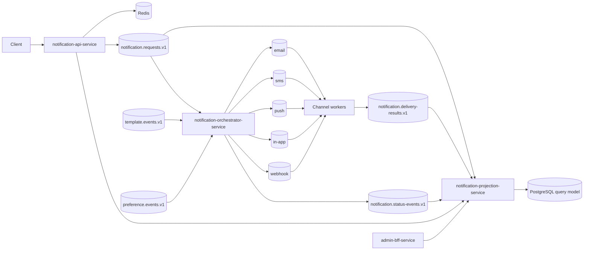

# Notification Platform Architecture

## System shape

The platform is event-driven. Kafka is the only notification transport; PostgreSQL stores service-owned durable state and Redis is used only for admission control and short-lived acceptance/idempotency lookup.

## Intake

1. The API validates a single-recipient, single-channel request.
2. Admission control applies a local concurrency cap plus Redis-backed global and tenant rates.
3. The API publishes `NotificationRequested` with `acks=all` and a bounded publish timeout.
4. After acknowledgement, it stores short-lived acceptance/idempotency state in Redis and returns `202`.
5. Kafka or producer pressure yields a retryable HTTP error; the API does not create notification database rows.

The stable request key is `tenantId:userId`, so ordering is guaranteed only within a Kafka partition.

## Orchestration

The orchestrator consumes requests transactionally:

- a processed-event table provides durable deduplication;
- template and preference decisions come from local, event-fed projections;
- missing templates reject the request;
- a missing preference defaults to enabled, matching preference-service semantics;
- rendered `DeliveryRequested` commands and status events enter the orchestrator's PostgreSQL outbox in the same transaction.

A scheduled publisher sends claimed outbox records to Kafka and marks them published. This closes the database/Kafka atomicity gap, but provider side effects remain at-least-once.

## Delivery

Each channel worker consumes its primary topic through the shared Kafka coordinator. It:

1. validates and deserializes the event;
2. deduplicates by event ID in the worker-owned schema;
3. persists an attempt before/around the provider boundary;
4. calls the channel provider;
5. publishes a delivery result;
6. routes transient failures through 1-minute, 5-minute, and 30-minute retry topics;
7. routes malformed, permanent, or exhausted events to the channel DLQ.

Provider idempotency keys reduce duplicate side effects, but exactly-once external delivery is not claimed.

## Query model

The projection service consumes requests, status events, and delivery results into a separate PostgreSQL schema. It is the canonical query model for API and admin reads. Projection lag is expected; immediately after acceptance, the API may return the Redis acceptance state until a projection row exists.

Projection data is rebuildable by clearing the schema and replaying retained Kafka topics with a fresh consumer group. Topic retention must cover the desired rebuild horizon.

## Service boundaries

- Every durable table has one owning service.
- Event contracts contain no persistence entities.
- Template/preference services publish changes; the orchestrator does not call them in the request path.
- Workers never write another service's schema.
- The BFF owns no business state and exposes no legacy retry mutation.

## Known design risks

- The orchestrator outbox publisher performs broker publication in its claim transaction, so a slow broker can hold database resources.
- Reference projections require their event history to be available before requests can be rendered reliably.
- The projection rebuild endpoint is operationally powerful and currently lacks authentication.
- Kafka is configured as a single node in local Compose; Kubernetes expects an external Kafka installation.
- Local provider adapters and plaintext local credentials are not production security controls.
