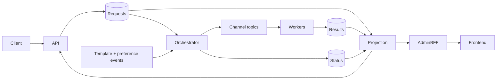

# Codebase Understanding Guide

This guide describes the current repository after removal of the pre-Kafka compatibility architecture. Source code, Flyway migrations, and event contracts are authoritative.

## 1. Mental model

The system accepts one notification for one recipient/channel, durably places it in Kafka, resolves local template and preference projections in an orchestrator, and sends a channel command to a worker. Workers own provider interaction, retries, and DLQs. A separate projection service builds the read model used by the API and admin UI.

The three most important invariants are:

1. Kafka acknowledgement, not a database insert, defines API acceptance.
2. A service writes only its own PostgreSQL schema.
3. External provider effects are at-least-once, so IDs and deduplication are part of correctness.

## 2. Repository map

| Path | Purpose |
| --- | --- |
| `services/` | Maven reactor, Spring Boot services, shared contracts/support |
| `frontend/` | React/Vite/TanStack Query admin application |
| `scripts/kafka/` | Deterministic topic creation |
| `scripts/load/` | k6 intake, burst, stress, end-to-end, and backlog helpers |
| `scripts/test/` | Integration and gated destructive failure scenarios |
| `tests/load/` | k6 scenarios and threshold environment template |
| `docker-compose.microservices.yml` | Complete local topology |
| `k8s/base/` | Learning Kubernetes workloads and scalers |
| `observability/` | Prometheus, Grafana, Loki, Promtail, OTel configuration |
| `docs/` | Architecture, contracts, operations, results, and this guide |

`services/pom.xml` builds 14 modules: three shared modules and eleven executable services. Shared resources are copied into each module by the parent build.

## 3. Runtime services

| Service | Input | Durable ownership | Output |
| --- | --- | --- | --- |
| Notification API | HTTP | None; Redis acceptance cache is temporary | `notification.requests.v1` |
| Orchestrator | Request/template/preference topics | Workflow deduplication, reference projections, durable outbox | Channel and status topics |
| Projection | Request/status/result topics | Rebuildable notification and delivery views | HTTP query API |
| Template | HTTP | Products, templates, template outbox | `template.events.v1` |
| Preference | HTTP | Preferences, preference outbox | `preference.events.v1` |
| Email worker | Email/retry topics | Email attempts/deduplication | SMTP/test provider, result/retry/DLQ |
| SMS worker | SMS/retry topics | SMS attempts/deduplication/test inbox | Result/retry/DLQ |
| Push worker | Push/retry topics | Push attempts/deduplication/test inbox | Result/retry/DLQ |
| In-app worker | In-app/retry topics | Attempts and user inbox | Result/retry/DLQ |
| Webhook worker | Webhook/retry topics | Attempts and local receiver history | HTTP/test provider, result/retry/DLQ |
| Admin BFF | HTTP | None | Calls API, projection, catalog, and test endpoints |

Ports and local infrastructure are listed in the root README.

## 4. End-to-end flows

### 4.1 Intake

`NotificationController` accepts `POST /notifications` and delegates to `NotificationIntakeService`.

The admission sequence is deliberate:

1. request body validation and size enforcement;
2. local semaphore acquisition;
3. Redis global fixed-window rate check;
4. Redis tenant fixed-window rate check;
5. construction of `NotificationRequested`;
6. Kafka send using the stable `tenantId:userId` key;
7. wait for broker acknowledgement within the configured deadline;
8. write short-lived Redis acceptance/idempotency state;
9. return `202`.

Redis failure fails closed with `503` because silently bypassing admission protection could overload Kafka or downstream providers. Kafka timeout, buffer exhaustion, or publication failure is also retryable and does not produce a false acceptance.

Duplicate HTTP requests are suppressed by the Redis idempotency key for a limited window; the orchestrator later enforces durable request/idempotency deduplication.

### 4.2 Orchestration

The request consumer starts one database transaction. It records the event as processed, resolves the referenced template and preference from local projections, renders the content, and writes both delivery commands and status changes to its outbox.

Reference data arrives through `AggregateChangedEvent` records. Aggregate versions prevent an older replay from replacing newer projection state. A template projection miss is a rejection because rendering cannot proceed safely. A missing preference means enabled, matching the preference service's default behavior.

The outbox publisher claims rows, publishes to the target Kafka topic, then marks them published. If publishing fails, the row remains available and `orchestrator_outbox_failures_total` increments.

### 4.3 Worker delivery

Each `*KafkaDeliveryConsumer` is a thin adapter around `KafkaWorkerCoordinator` plus a channel-specific processor. The coordinator centralizes:

- schema/channel validation;
- processed-event deduplication;
- bounded concurrency;
- provider rate limiting;
- retry stage calculation;
- result, retry, and DLQ publication;
- source metadata preservation.

The channel processor persists and measures the provider attempt. It never updates notification or projection tables. Success/failure becomes `DeliveryResult`, which is projected asynchronously.

### 4.4 Retry and DLQ

Transient errors progress through 1-minute, 5-minute, and 30-minute topics. Consumers delay by pausing/nacking rather than sleeping a worker thread. Permanent, malformed, or exhausted events enter a channel-specific DLQ.

No admin replay endpoint currently exists. A safe future replay feature must preserve notification/delivery IDs, generate auditable event IDs, validate the operator, and cap replay loops.

### 4.5 Query and status

The projection service idempotently consumes:

- `NotificationRequested` into notification views;
- `NotificationStatusChanged` into workflow state;
- `DeliveryResult` into delivery attempts and aggregate notification status.

The API queries the projection first. For the short period before the request event is projected, status lookup can return Redis acceptance state. Projection errors other than a true `404` propagate instead of being silently hidden.

The BFF forwards pageable notification/delivery queries and current statistics. The frontend types mirror the projection contract rather than synthesizing fields that do not exist.

### 4.6 Template/preference update

Template or preference writes update the owning table and an owner-local event outbox in one transaction. Their publishers emit versioned change events. The orchestrator applies only newer aggregate versions. Operators can rebuild reference projections with the supplied rebuild workflow when retained events are available.

## 5. Key modules and implementation choices

### `shared-event-contracts`

Contains wire DTOs, not JPA/JDBC entities. Every event has an `eventId` and `schemaVersion`. Add optional fields for compatible evolution; introduce a new version for incompatible meaning/type changes.

### `worker-kafka-support`

Avoid duplicating retry/DLQ state machines in workers. Changes here affect all five channels and require tests for stage transitions, quota windows, malformed messages, permanent errors, and duplicates.

### `platform-common`

Provides shared HTTP correlation and runtime conventions. The parent POM provides observability/test libraries; database and validation dependencies are declared only by modules that use them.

### PostgreSQL outboxes

Outboxes remain in the orchestrator, template, and preference services because each must atomically combine an owner-local database change with event publication. There is no notification API outbox and no standalone cross-service publisher.

### CQRS projection

The projection is intentionally denormalized and rebuildable. It trades immediate consistency for cheap queries and decoupled writes. Kafka retention is therefore part of backup/recovery design, not just broker tuning.

## 6. Configuration

`services/shared-resources/application.yml` supplies common actuator, metrics, tracing, and logging defaults. Each service resource file supplies its name, Kafka settings, datasource schema when applicable, and service-specific properties.

Compose uses:

- one local Kafka KRaft broker with topic auto-creation disabled;
- `kafka-topic-init` to create every primary/retry/DLQ/reference topic;
- one PostgreSQL server with isolated schemas and small Hikari pools;
- Redis for intake state;
- deterministic test providers except SMTP email through MailHog by default.

Kubernetes assumes Kafka exists externally. Environment variables in Compose and Kubernetes must map to actual configuration properties; remove stale variables rather than preserving speculative switches.

## 7. Reliability and scalability review

| Risk | Why it matters | Safe direction |
| --- | --- | --- |
| Broker publish occurs inside orchestrator outbox transaction | Slow Kafka can hold connections/locks | Claim with a lease, publish outside the claim transaction, complete with compare-and-set |
| Provider call can succeed before result publication | Crash can cause duplicate side effect | Pass `deliveryId` as provider idempotency key and reconcile attempts |
| Redis is required for admission | Redis outage rejects intake | Deploy Redis HA; choose and document fail-closed policy |
| Reference projection lag/missing history | Valid requests can reject after template miss | Monitor lag and guarantee topic retention/rebuild sequencing |
| Projection eventual consistency | Immediate queries can briefly be absent | Preserve acceptance fallback and communicate 202 semantics |
| Single local Kafka/Postgres | No local HA/failure isolation | Use replicated managed/operator infrastructure for production |
| Static retry stages | May not fit provider quotas/outages | Tune by channel/provider with jitter and retry budgets |
| No authentication/authorization | Admin/rebuild endpoints are powerful | Add identity, authorization, audit, and network controls |
| In-memory/local test providers | Not production integrations | Add real adapters with timeouts, quotas, idempotency, and contract tests |
| Consumer scaling and key skew | Hot tenants/users can limit throughput | Measure partition distribution and lag before increasing replicas |

Capacity is bounded by the slowest of API admission, Kafka partitions, orchestrator DB/outbox, worker/provider quota, and projection writes. More worker replicas do not bypass a provider quota or a hot partition key.

## 8. Safe modification playbooks

### Add a request/event field

1. Decide whether the field belongs in the public API and the wire contract.
2. Add it compatibly to `shared-event-contracts`.
3. Update API mapping and serialization tests.
4. Update orchestrator use and projection storage if queryable.
5. Add a forward-only Flyway migration.
6. Update BFF/frontend types together.
7. Test old payload deserialization and new round trips.

### Add a channel

1. Add channel topic/retry/DLQ names to the topic script.
2. Extend validation and event routing.
3. Create a worker using `worker-kafka-support`.
4. Give it an owner schema and migrations.
5. Add provider idempotency, timeouts, metrics, and test adapter.
6. Update Compose, Kubernetes, KEDA, dashboards, BFF, UI, and docs.
7. Run duplicate, transient, permanent, DLQ, and end-to-end tests.

### Change a database schema

Add a new owner-local Flyway migration. Keep rolling-deployment compatibility: expand first, deploy readers/writers, then contract in a later release. Never edit an applied migration or reach into another schema.

### Change retry behavior

Start in `KafkaWorkerCoordinator`. Verify every channel still classifies failures correctly and that retry records retain lineage. Do not implement blocking sleeps.

### Change projection queries

Treat projection HTTP shapes as canonical. Update repository query/count logic, controller page wrapper, BFF forwarding, TypeScript interfaces, page rendering, and rebuild expectations together.

## 9. Verification map

- Backend unit/contract tests: `mvn -f services/pom.xml test`
- Backend compilation/package: `mvn -f services/pom.xml package -DskipTests`
- Frontend lint/build: `npm --prefix frontend run lint` and `npm --prefix frontend run build`
- Compose validation: `docker compose config`
- Shell syntax: `bash -n` over scripts
- JSON validity: `jq empty` over dashboards
- Integration smoke: `scripts/test/kafka-flow.sh`
- Destructive isolated scenarios: `scripts/test/failure-scenarios.sh` with its opt-in guard
- Load scenarios: `scripts/load/`

Historical local results are recorded in `load-testing.md` and `failure-scenarios.md`. Do not present them as production capacity or as proof after code/config changes without rerunning.

## 10. Interview explanation

A concise explanation:

> The platform accepts notification commands through an admission-controlled Spring API and returns 202 only after an `acks=all` Kafka acknowledgement. A stateful orchestrator durably deduplicates requests, resolves event-fed template and preference projections, and uses a PostgreSQL outbox to fan out channel commands. Channel workers isolate providers and share an at-least-once retry/DLQ coordinator. Results and workflow events build a separate PostgreSQL CQRS projection for API and admin reads.

Be ready to explain:

- why `202` is acceptance rather than delivery;
- why Kafka and provider exactly-once are different problems;
- how the orchestrator outbox closes the database/broker atomicity gap;
- where ordering exists and how partition keys affect scaling;
- how duplicate HTTP requests, events, and provider attempts differ;
- how reference and query projections rebuild;
- why Redis fails closed at intake;
- what happens on Kafka, PostgreSQL, projection, worker, and provider failure;
- which local choices are intentionally not production-ready.

## 11. First files to read

1. `docs/architecture.md`
2. `services/shared-event-contracts/src/main/java/...`
3. Notification API controller and `KafkaIntakeComponents.java`
4. `NotificationOrchestratorApplication.java`
5. `KafkaWorkerCoordinator.java`
6. One channel worker and its Kafka adapter
7. `NotificationProjectionApplication.java`
8. Template/preference outbox classes
9. `docker-compose.microservices.yml` and `scripts/kafka/create-topics.sh`
10. Flyway migrations for each database owner
