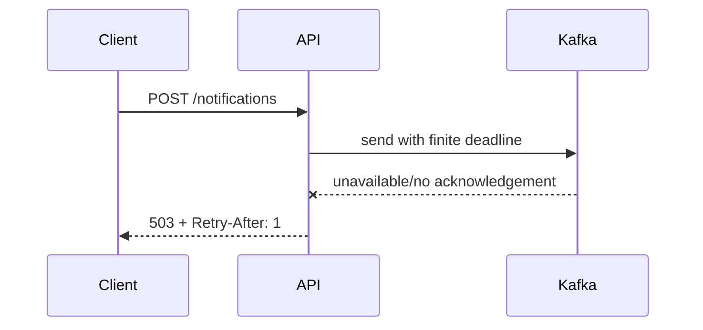
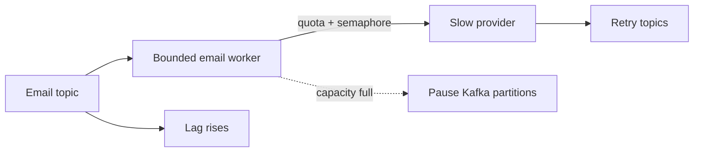

# Failure Scenarios

## Kafka outage



The API owns no notification database tables and must not wait for a generic HTTP timeout.

## Provider slowdown



Other channel partitions remain independent. Provider quotas bound useful concurrency even when lag-based autoscaling requests more replicas.

## Projection database outage

```mermaid
sequenceDiagram
    participant K as Kafka
    participant P as Projection consumer
    participant DB as PostgreSQL
    K->>P: projection event
    P->>DB: update
    DB--xP: unavailable
    P-->>K: do not commit offset
    Note over K,P: records remain durable; lag grows
    DB-->>P: recovered
    P->>DB: idempotent update
    P-->>K: commit offset
```

`scripts/test/failure-scenarios.sh` is intentionally gated because it stops infrastructure. Set `RUN_DESTRUCTIVE_FAILURE_TESTS=1` only in an isolated local environment.

Select one scenario per run:

```bash
RUN_DESTRUCTIVE_FAILURE_TESTS=1 SCENARIO=kafka-outage ./scripts/test/failure-scenarios.sh
RUN_DESTRUCTIVE_FAILURE_TESTS=1 SCENARIO=postgres-outage ./scripts/test/failure-scenarios.sh
RUN_DESTRUCTIVE_FAILURE_TESTS=1 SCENARIO=projection-restart ./scripts/test/failure-scenarios.sh
RUN_DESTRUCTIVE_FAILURE_TESTS=1 SCENARIO=worker-restart ./scripts/test/failure-scenarios.sh
RUN_DESTRUCTIVE_FAILURE_TESTS=1 SCENARIO=provider-slowdown ./scripts/test/failure-scenarios.sh
```

The local Compose topology uses one PostgreSQL instance for several service-owned schemas, so `postgres-outage` is broader than a projection-only database outage. Use isolated infrastructure in production-like validation to test only the projection database.

## Executed result

On 2026-07-10 the gated Kafka-outage scenario passed: the broker was stopped, `POST /notifications` returned HTTP `503` within the configured publication deadline, the response was a structured problem document, and the broker restarted healthy. Projection/provider outage scenarios remain pending and were not run during the Phase 4–10 implementation passes.
