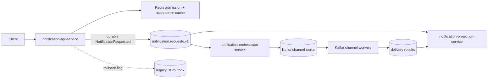
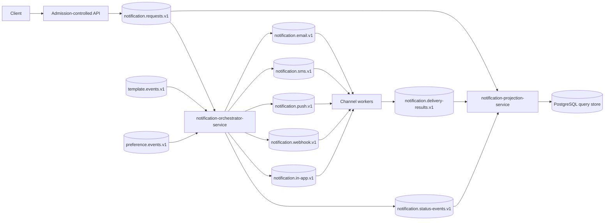
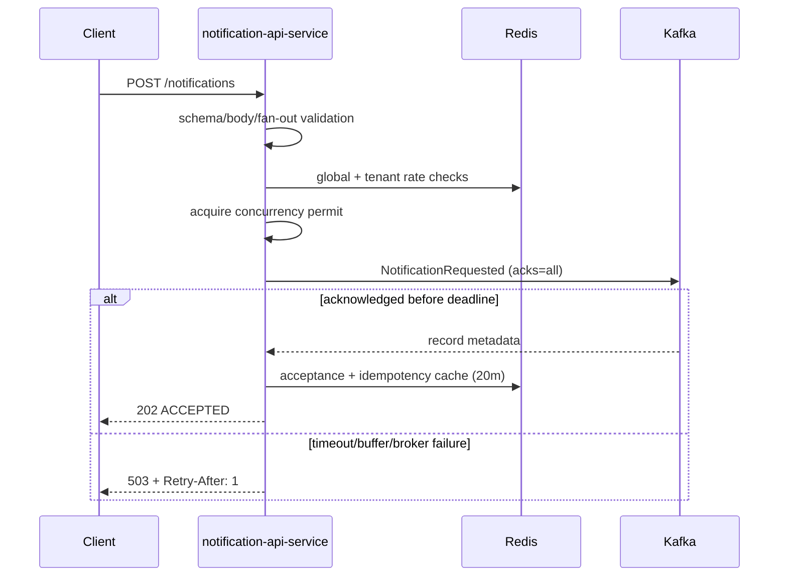
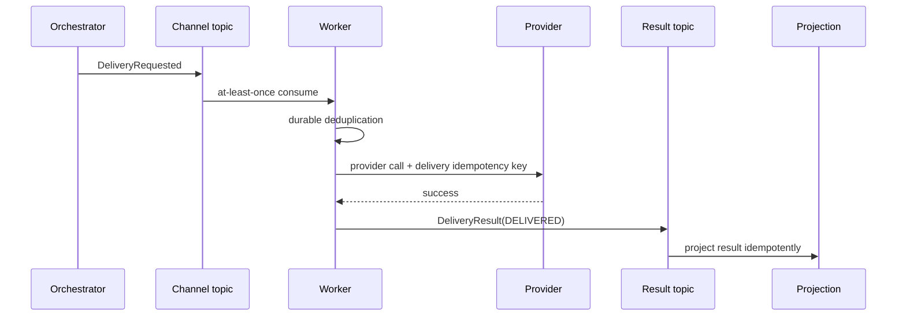
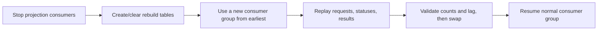

# Kafka-First Architecture

## Current migration state (Phases 1–8 implemented)

Kafka is the first durable intake write and the default delivery transport. The legacy synchronous DB/outbox and RabbitMQ path remains available for rollback.

UUID identifiers are retained for API and PostgreSQL compatibility; event contracts treat IDs as opaque strings. The current HTTP contract remains single-recipient/single-channel, while the orchestrator is structured to emit a child command for every requested channel.

## Intake sequence

`ACCEPTED` means Kafka acknowledged the command under the configured producer durability settings. It does not mean rendering, preference evaluation, scheduling, or provider delivery succeeded. The permanent query projection can lag; status lookup checks the projection first, legacy storage second, then Redis acceptance state.

## Ordering and partitioning

Intake and delivery records use `tenantId:recipientId` as the stable key. Ordering exists only within a partition. Global ordering is not provided. Partition count is configurable and is never assumed to equal worker count.

## Successful delivery sequence

## Projection rebuild

## Outbox decision

Kafka-first notification intake removes the initial database/Kafka dual write: the API does not create notification, delivery, or outbox rows in Kafka mode. The old tables and code remain for rollback. The orchestrator, template service, and preference service each use a service-owned transactional outbox for their database/event boundary.
