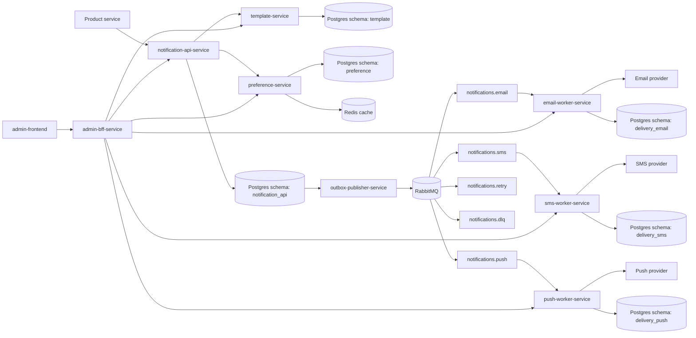
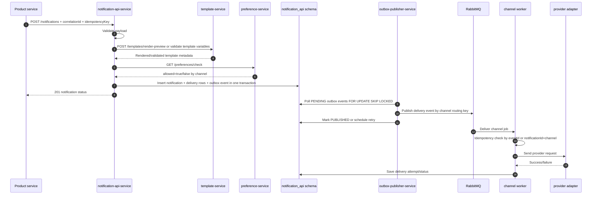

# Notification Platform Microservices Architecture

This document describes the learning-focused microservices target architecture for this repository.

The `services/` workspace defines separate Spring Boot service modules with owned schemas, APIs, health probes, and asynchronous delivery workers. `docker-compose.microservices.yml` and `k8s/base/microservices.yaml` define the local and Kubernetes runtime shapes.

## Goals

- Practice realistic microservices architecture.
- Keep service boundaries clear and understandable.
- Use HTTP for synchronous commands and queries.
- Use a message broker for asynchronous delivery jobs.
- Prefer database-per-service. For local development, schema-per-service in one PostgreSQL instance is acceptable.
- Add correlation IDs, idempotency, structured logs, health checks, metrics, and Kubernetes deployment primitives.

## Target Services

| Service | Responsibility | Owned data |
| --- | --- | --- |
| `notification-api-service` | Accept notification requests, validate payload, call template/preference services, create notification records, write outbox events, expose notification status. | `notification_api.notifications`, `notification_api.notification_deliveries`, `notification_api.outbox_events` |
| `template-service` | CRUD templates, render preview, validate required variables. | `template.notification_templates` |
| `preference-service` | Manage and check user/product notification preferences. | `preference.user_notification_preferences` |
| `outbox-publisher-service` | Poll outbox events, publish broker messages, mark published/failed/dead-lettered. | Reads/writes `notification_api.outbox_events` |
| `email-worker-service` | Consume email jobs, call email provider adapter, save email attempts/status idempotently. | `delivery_email.delivery_attempts`, optional projection/status table |
| `sms-worker-service` | Consume SMS jobs, call SMS provider adapter, save SMS attempts/status idempotently. | `delivery_sms.delivery_attempts`, optional projection/status table |
| `push-worker-service` | Consume push jobs, call push provider adapter, save push attempts/status idempotently. | `delivery_push.delivery_attempts`, optional projection/status table |
| `in-app-worker-service` | Consume in-app jobs, store in-app notifications, expose read/unread APIs. | `delivery_in_app.in_app_notifications`, `delivery_in_app.processed_events` |
| `webhook-worker-service` | Consume webhook jobs, send HTTP webhook requests, expose local webhook receiver in test mode. | `delivery_webhook.delivery_attempts`, `delivery_webhook.received_webhooks`, `delivery_webhook.processed_events` |
| `admin-bff-service` | Backend-for-Frontend, aggregates notification/template/preference/delivery data for admin tables and dashboard. | Ideally stateless |
| `admin-frontend` | Admin UI for notifications, outbox events, templates, preferences, and dashboard metrics. | No database |

## Architecture Diagram



## Notification Sending Sequence



## Service API Boundaries

### notification-api-service

Primary endpoints:

- `POST /notifications`
- `GET /notifications/{notificationId}`
- `GET /notifications`
- `GET /notifications/{notificationId}/deliveries`
- `GET /outbox-events`
- `GET /health/live`
- `GET /health/ready`
- `GET /actuator/prometheus`

Responsibilities:

- Validate notification request shape.
- Require idempotency key.
- Require or create `correlationId`.
- Call `template-service` for template existence/render validation.
- Call `preference-service` to check allowed channels.
- Persist notification and delivery intent.
- Persist outbox event in the same DB transaction.
- Expose paginated status APIs.

Outbox event status model:

- `PENDING`
- `PROCESSING`
- `PUBLISHED`
- `FAILED`
- `DEAD_LETTER`

Outbox fields:

- `event_id`
- `aggregate_id`
- `aggregate_type`
- `event_type`
- `channel`
- `payload`
- `status`
- `attempt_count`
- `locked_until`
- `last_error`
- `available_at`
- `published_at`
- `created_at`

### template-service

Primary endpoints:

- `POST /templates`
- `GET /templates`
- `GET /templates/{templateId}`
- `PUT /templates/{templateId}`
- `DELETE /templates/{templateId}`
- `POST /templates/{templateId}/preview`
- `POST /templates/validate`

Responsibilities:

- Own templates schema.
- Enforce active template uniqueness per product/template/channel.
- Extract required variables from template content.
- Render preview using supplied payload.
- Validate missing variables before notification acceptance.

### preference-service

Primary endpoints:

- `GET /preferences`
- `PUT /preferences`
- `GET /preferences/check?productId=&externalUserId=&category=&channel=`

Responsibilities:

- Own preference schema.
- Upsert preference rows.
- Return allow/deny by product, user, category, and channel.
- Default to allowed when no row exists.
- Cache preference checks in Redis where useful.

### outbox-publisher-service

Primary endpoints:

- `GET /health/live`
- `GET /health/ready`
- `GET /actuator/prometheus`

Responsibilities:

- Poll `notification_api.outbox_events`.
- Use `FOR UPDATE SKIP LOCKED` or equivalent.
- Claim events by moving `PENDING` to `PROCESSING` and setting `locked_until`.
- Publish broker messages by channel.
- Mark `PUBLISHED` after broker confirm.
- Mark `FAILED` with retry metadata on temporary publish failure.
- Move to `DEAD_LETTER` after max publish attempts.

Polling query shape:

```sql
select *
from notification_api.outbox_events
where status in ('PENDING', 'FAILED')
  and available_at <= now()
order by available_at asc, created_at asc
limit :batchSize
for update skip locked;
```

Retry backoff:

```text
next_available_at = now + min(baseDelay * 2 ^ attempt_count, maxDelay)
```

### channel worker services

Primary endpoints:

- `GET /health/live`
- `GET /health/ready`
- `GET /actuator/prometheus`
- Optional admin/debug endpoint: `GET /delivery-attempts`

Responsibilities:

- Consume channel-specific queue.
- Enforce idempotency by `eventId` or `(notificationId, channel)`.
- Call provider adapter.
- Save delivery attempt.
- Emit delivery status event or update delivery projection.
- Retry temporary provider failures.
- Dead-letter permanent or exhausted failures.

Queues:

- `notifications.email`
- `notifications.sms`
- `notifications.push`
- `notifications.retry`
- `notifications.dlq`

### admin-bff-service

Primary endpoints:

- `GET /admin/dashboard`
- `GET /admin/notifications`
- `GET /admin/outbox-events`
- `GET /admin/templates`
- `GET /admin/preferences`
- `GET /admin/deliveries`

Responsibilities:

- Aggregate data from backend services.
- Expose paginated, filtered, sortable APIs for frontend tables.
- Hide internal service topology from frontend.
- Preserve and propagate `correlationId`.

### admin-frontend

Required pages:

- Dashboard with total notifications today, sent count, failed count, pending outbox count, retry count, provider error rate, and throughput per minute.
- Notifications table with server pagination, filters, and sorting.
- Outbox events table.
- Templates CRUD.
- Preferences CRUD.
- Delivery attempts/status table.

## Cross-Cutting Rules

### Correlation ID

Every inbound HTTP request should use:

- Header: `X-Correlation-Id`.
- If absent, service generates a UUID.
- Include in logs as `correlationId`.
- Propagate to downstream HTTP calls.
- Include in message headers for RabbitMQ.

### Structured Logs

Log JSON or stable key-value fields to stdout:

```text
timestamp level service correlationId notificationId eventId channel message
```

Kubernetes will collect stdout logs.

### Health Endpoints

Every backend service should expose:

- `/health/live`: process is alive.
- `/health/ready`: dependencies are reachable enough to receive traffic.
- `/actuator/prometheus`: Prometheus metrics when Spring Boot Actuator is enabled.

### Pagination

All list APIs should accept:

- `page`
- `size`
- `sort`
- domain filters, for example `status`, `channel`, `productId`, `createdFrom`, `createdTo`

Responses should include:

```json
{
  "items": [],
  "page": 0,
  "size": 50,
  "totalElements": 123,
  "totalPages": 3
}
```

### Error Handling

Use a consistent error shape:

```json
{
  "timestamp": "2026-06-11T10:00:00Z",
  "status": 400,
  "error": "Bad Request",
  "message": "Template variable name is required",
  "path": "/templates/validate",
  "correlationId": "5b1f2bb6-cc62-4a45-b352-4469ee4eb584"
}
```

## Database Ownership

Production target:

- Database per service.

Local learning target:

- One PostgreSQL instance.
- One schema per owning service.

Schemas:

- `notification_api`
- `template`
- `preference`
- `delivery_email`
- `delivery_sms`
- `delivery_push`

Do not let services write to another service's owned schema except the `outbox-publisher-service`, which is an operational companion of `notification-api-service` and intentionally owns outbox publishing lifecycle.

## Failure Scenarios

### Broker Down

What happens:

- `notification-api-service` still accepts requests because it only writes DB/outbox.
- `outbox-publisher-service` fails to publish and increments `attempt_count`.
- Events remain `PENDING` or `FAILED` with future `available_at`.

Operational checks:

```sql
select status, count(*)
from notification_api.outbox_events
group by status;
```

Fix:

- Restore RabbitMQ.
- Publisher resumes and drains pending events.

### Worker Crash

What happens:

- Broker redelivers unacked message.
- If provider was not called, next worker can process normally.
- If provider was called but worker crashed before recording status, consumer idempotency and provider idempotency become critical.

Fix:

- Store idempotency by `eventId` or `(notificationId, channel)`.
- Use provider idempotency keys where provider supports them.
- Track attempt state before and after provider calls.

### Outbox Publisher Crash After Publish

What happens:

- Message may already be in RabbitMQ.
- Outbox row may still be `PROCESSING` or not marked `PUBLISHED`.
- A later publisher may republish.

Fix:

- Accept at-least-once publish.
- Consumers must be idempotent.
- Use `locked_until` to release stuck `PROCESSING` events.
- Mark event published only after broker confirm.

### Provider Failure

Temporary:

- Worker records failed attempt.
- Schedules retry with exponential backoff.

Permanent:

- Worker records failed attempt.
- Moves message/delivery to dead-letter state.

Operational checks:

- Provider error rate metric.
- Retry queue depth.
- DLQ depth.

### Duplicate Event

What happens:

- Same broker event may arrive twice.
- Worker checks `eventId` or `(notificationId, channel)`.
- If already processed, worker acks and skips provider call.

Required table:

```sql
create table processed_events (
    event_id uuid primary key,
    notification_id uuid not null,
    channel varchar(32) not null,
    processed_at timestamptz not null
);
```

## Local Development

Microservices:

```bash
mvn -f services/pom.xml package -DskipTests
docker compose up -d
```

Important local URLs:

- notification-api-service: `http://localhost:8081`
- template-service: `http://localhost:8082`
- preference-service: `http://localhost:8083`
- outbox-publisher-service: `http://localhost:8084`
- email-worker-service: `http://localhost:8085`
- sms-worker-service: `http://localhost:8086`
- push-worker-service: `http://localhost:8087`
- admin-bff-service: `http://localhost:8088`
- in-app-worker-service: `http://localhost:8089`
- webhook-worker-service: `http://localhost:8090`
- admin-frontend: `http://localhost:5173`
- MailHog: `http://localhost:8025`
- RabbitMQ UI: `http://localhost:15672`

## Kubernetes Deployment

Apply local manifests:

```bash
kubectl apply -f k8s/base/microservices.yaml
```

Check status:

```bash
kubectl -n notification-platform get pods
kubectl -n notification-platform get svc
kubectl -n notification-platform get hpa
```

Logs:

```bash
kubectl -n notification-platform logs deploy/notification-api-service
kubectl -n notification-platform logs deploy/outbox-publisher-service
kubectl -n notification-platform logs deploy/email-worker-service
```

Production notes:

- Replace local Postgres/RabbitMQ/Redis manifests with managed services or operators.
- Replace inline Secret examples with external secret management.
- Set real image tags instead of `:local`.
- Add ingress or gateway routing.
- Add PodDisruptionBudgets for critical services.
- Add network policies so only allowed services can talk to each other.

## Implementation Roadmap

1. Add shared conventions package or copy minimal cross-cutting filters:
   - `CorrelationIdFilter`
   - `GlobalExceptionHandler`
   - `PageResponse`
   - health endpoint adapter for `/health/live` and `/health/ready`
2. Extract `template-service` first because it has a clean CRUD boundary.
3. Extract `preference-service` next and expose `/preferences/check`.
4. Extract `notification-api-service` with sync clients to template/preference.
5. Extract outbox table and publisher service.
6. Split worker code by channel and add processed-event idempotency tables.
7. Add admin BFF aggregation APIs.
8. Point frontend to admin BFF and add missing tables.
9. Add integration tests with Testcontainers for each service.
