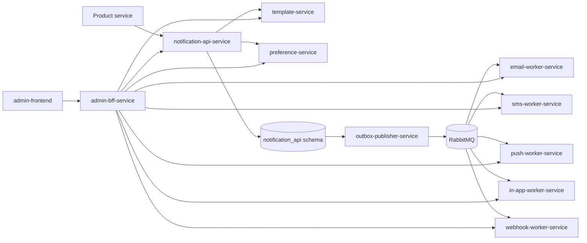
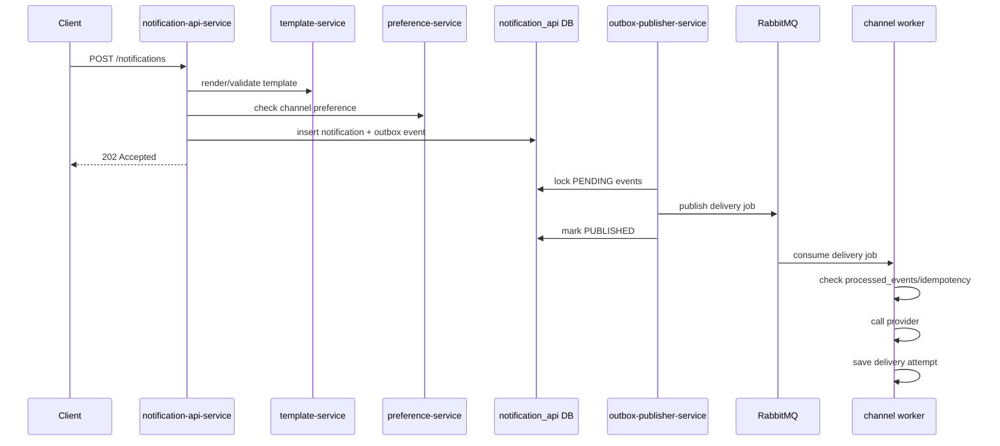
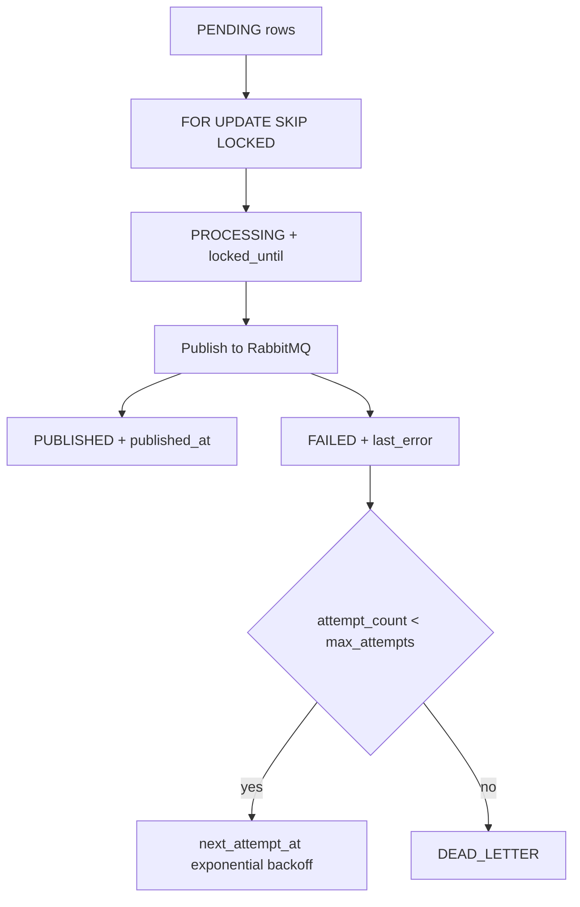
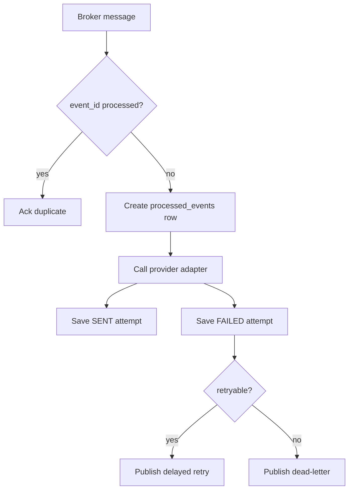
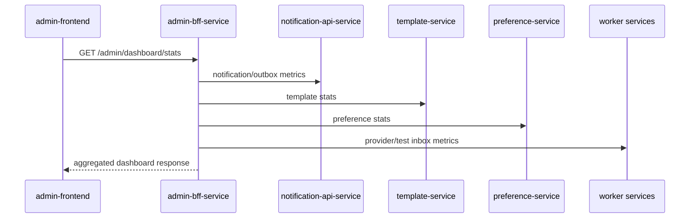

# Refactor To Microservices

This repository has been refactored from a single Spring Boot notification application into a learning-focused microservices architecture. Runtime responsibilities live in independently runnable services under `services/`.

## Before And After

Before:

- One Spring Boot app owned notification submission, templates, preferences, outbox publishing, RabbitMQ delivery, provider calls, admin APIs, and delivery attempts.
- One database schema held all domain tables.
- Local Docker Compose mostly started shared infrastructure.

After:

- Each bounded context has a separate Spring Boot service module.
- Local development uses schema-per-service in one PostgreSQL instance.
- Async delivery flows through RabbitMQ and the outbox publisher.
- Local providers make email, SMS, push, in-app, and webhook delivery testable without external vendors.

## Service Boundaries

| Service | Responsibility |
| --- | --- |
| `notification-api-service` | Validate notification requests, call template/preference services, persist notification state, write outbox events in the same transaction, expose status APIs. |
| `template-service` | Own templates, render previews, and validate required variables. |
| `preference-service` | Own user/product/channel preferences and expose allow/deny checks. |
| `outbox-publisher-service` | Lock pending outbox rows, publish broker messages, update status, retry with backoff, mark dead letters. |
| `email-worker-service` | Consume email jobs, send via SMTP/MailHog or test provider, save attempts, enforce idempotency. |
| `sms-worker-service` | Consume SMS jobs, use `TestSmsProvider` locally, save attempts, expose SMS test inbox APIs. |
| `push-worker-service` | Consume push jobs, use `TestPushProvider` locally, save attempts, expose push test inbox APIs. |
| `in-app-worker-service` | Consume in-app jobs, store in-app notifications, expose read/unread APIs. |
| `webhook-worker-service` | Consume webhook jobs, send HTTP webhooks, expose a local webhook receiver. |
| `admin-bff-service` | Aggregate data for admin dashboard, tables, templates, preferences, and test inboxes. |
| `admin-frontend` | Admin UI for dashboard, notifications, outbox, templates, preferences, and test inboxes. |

## Database Ownership

Production should use database-per-service. Local development currently uses schema-per-service:

- `notification_api`
- `template`
- `preference`
- `delivery_email`
- `delivery_sms`
- `delivery_push`
- `delivery_in_app`
- `delivery_webhook`

No service should write to another service's schema. The only intentional exception is `outbox-publisher-service`, which acts as the operational publisher for `notification-api-service` outbox rows.

## System Architecture



## Notification Sequence Flow



## Outbox Publishing Flow



## Worker Delivery Flow



## Admin Dashboard Flow



## Provider Strategy

Provider interfaces live in each worker service while business logic remains service-local:

- `EmailProvider.sendEmail(command)`
- `SmsProvider.sendSms(command)`
- `PushProvider.sendPush(command)`
- `InAppProvider.createInAppNotification(command)`
- `WebhookProvider.sendWebhook(command)`

Provider result fields:

- `provider`
- `providerMessageId`
- `status`
- `rawResponse`
- `errorCode`
- `errorMessage`
- `sentAt`

Local provider behavior:

- Recipient or URL containing `fail` returns `FAILED`.
- Recipient or URL containing `timeout` returns `TIMEOUT`.
- Recipient or URL containing `rate-limit` returns `RATE_LIMIT`.
- `TEST_PROVIDER_FAILURE_RATE` controls random failures.
- `TEST_PROVIDER_LATENCY_MS` controls artificial latency.

## Local Test Provider Guide

Run the stack:

```bash
mvn -f services/pom.xml package -DskipTests
docker compose up -d --build
```

Useful local endpoints:

- MailHog UI: `http://localhost:8025`
- SMS inbox: `GET http://localhost:8086/test/sms-messages`
- Push inbox: `GET http://localhost:8087/test/push-messages`
- In-app inbox: `GET http://localhost:8089/test/in-app-notifications`
- User in-app notifications: `GET http://localhost:8089/users/{userId}/in-app-notifications`
- Local webhook receiver: `POST http://localhost:8090/webhooks/test`
- Received webhooks: `GET http://localhost:8090/received-webhooks`

## Outbox And Idempotency

The target outbox table must include:

- `event_id`
- `aggregate_type`
- `aggregate_id`
- `event_type`
- `payload`
- `status`
- `attempt_count`
- `max_attempts`
- `locked_until`
- `next_attempt_at`
- `last_error`
- `published_at`
- `created_at`
- `updated_at`

Workers must use a `processed_events` table or equivalent unique storage. A duplicate `event_id` must be acknowledged without calling the provider again. Delivery uniqueness should be enforced with either `event_id` or `notification_id + channel`.

## Kubernetes Deployment

Apply the local base manifests:

```bash
kubectl apply -f k8s/base/microservices.yaml
```

For production:

- Replace local Postgres, RabbitMQ, Redis, and MailHog with managed services.
- Disable test providers by requiring explicit production provider env vars.
- Add network policies.
- Add queue-depth-based KEDA scaling for workers if available.
- Keep outbox publisher horizontally scalable and rely on DB row locking.

## Failure Scenarios

Broker down:

- `notification-api-service` still writes notifications and outbox rows.
- `outbox-publisher-service` retries publishing with exponential backoff.

Worker crash:

- Broker redelivers unacked messages.
- Idempotency prevents duplicate provider sends.

Publisher crash after publish:

- Duplicate broker messages are possible.
- Workers must deduplicate by `event_id`.

Provider failure:

- Worker stores failed attempts.
- Retryable failures are retried.
- Permanent failures are dead-lettered.

Duplicate event:

- Worker detects `processed_events.event_id`.
- Message is acknowledged without calling provider.

## Testing

Run the workspace tests:

```bash
mvn test
```

Run the service module tests:

```bash
mvn -f services/pom.xml test
```

Current service tests cover local SMS, push, in-app, and webhook providers. The next test pass should add full persistence and broker integration tests with Testcontainers.

## Current Migration State

Implemented in this pass:

- Missing `in-app-worker-service` and `webhook-worker-service` modules.
- Local provider abstractions and test inbox APIs for email, SMS, push, in-app, and webhook paths.
- MailHog in the microservices local stack.
- Default `docker compose up` path for the microservices stack.
- Kubernetes entries for the new workers and MailHog.
- Focused provider tests.

Remaining hardening work:

- Add Testcontainers coverage for the complete cross-service flow.
- Add production provider adapters for SMS, push, and webhook delivery.
- Add authentication and authorization to admin and public APIs.
- Expand admin frontend pages to cover every BFF route.
