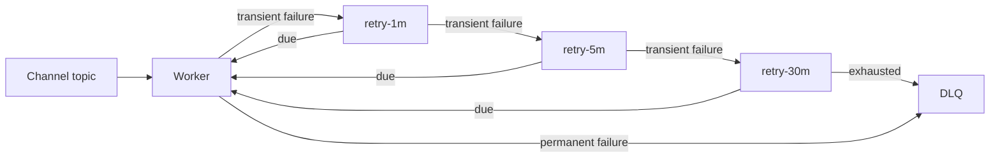

# Retry and DLQ Design

Every channel worker consumes its primary topic plus 1-minute, 5-minute, and 30-minute retry topics. Exhausted and malformed events are published to the channel DLQ. RabbitMQ consumers remain only for rollback.

Timeout, reset, provider 429/5xx, DNS, and temporary network failures are treated as transient. Invalid payload/address, unsupported channel, missing data, and non-retryable provider errors are permanent. Transient failures move through timestamp-delayed retry topics; consumers use Kafka pause/nack timing and do not sleep.

Retry records preserve original topic/partition/offset, attempt, first/last failure timestamps, and bounded error details. Automated retries retain notification/delivery IDs and create a new event ID. Operator-facing manual DLQ replay is not yet exposed; replay must retain IDs, record the actor, and cap loops when added.

