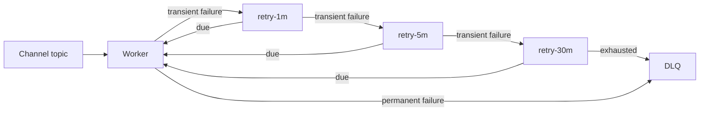

# Retry and DLQ Design

Phase 2 creates the 1-minute, 5-minute, 30-minute, and DLQ topics for every channel. Workers do not consume them yet; RabbitMQ delivery remains active through Phase 3.

Phase 6 will classify timeout, reset, provider 429/5xx, DNS, and temporary network failures as transient. Invalid address/payload, unsupported channel, missing template data, and non-retryable provider 4xx responses are permanent. Transient failures move through non-blocking retry topics with jitter; consumers must not sleep.

Retry records preserve original topic/partition/offset, attempt, first/last failure timestamps, and bounded error details. Manual replay will retain notification/delivery IDs, create a new replay event ID, record the actor, and cap replay loops. DLQ inspection/replay endpoints are deferred until the first Kafka worker migration.

